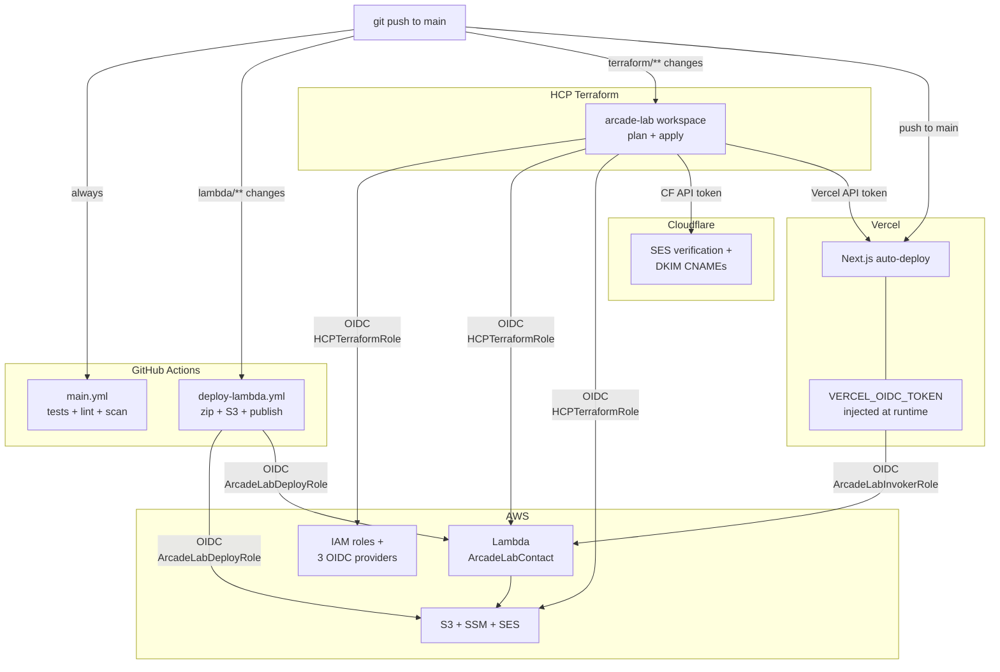

# Arcade Lab

Personal portfolio and technical blog of **Denes Beck** -- Software Engineer based in Budapest, Hungary.

Live at [arcade-lab.io](https://arcade-lab.io)

## Overview

Arcade Lab is a portfolio site featuring a retro/arcade-inspired dark theme with a custom monospace font (DepartureMono), animated UI elements, and a full-featured MDX-powered blog. The site showcases personal projects, technical writing, professional background, and provides a contact form backed by AWS Lambda.

It also includes an **MCP server** for Claude Code integration and an **AI-powered chat widget** that lets visitors ask questions about blog posts, projects, and the author.

The repository now also houses the **contact Lambda source code, its layers, and the Terraform configuration** that provisions every piece of cloud infrastructure (AWS, Cloudflare DNS, Vercel project settings). One workspace, one apply, end-to-end OIDC — no static cloud credentials anywhere.

## Pages

- **Home** -- Minimalist greeting with a contact CTA
- **Work** -- Portfolio of projects with tech stack, highlights, and links to related blog posts
- **About** -- Bio, skills (18 technologies), certificates (AWS Developer Associate, AWS CloudOps Associate, Terraform Associate), and social links
- **Blog** -- 28 MDX-based technical posts covering topics like building a home server, developing a custom VCS in Go, CloudGoat ethical hacking write-ups, CI/CD pipelines, and AWS Lambda deployments. Supports tag-based filtering.
- **Contact** -- Form protected by Cloudflare Turnstile CAPTCHA, submitted via AWS Lambda

## Tech Stack

| Category | Technologies |
|---|---|
| Framework | Next.js 16, React 19, TypeScript |
| Styling | Tailwind CSS v4, MUI Material |
| Content | MDX with rehype-highlight (Nord theme), remark-gfm, Mermaid diagrams |
| Backend | AWS Lambda via `@aws-sdk/client-lambda`, Cloudflare Turnstile |
| AI / Chat | Claude API (`@anthropic-ai/sdk`), MCP SDK (`@modelcontextprotocol/sdk`) |
| Build | Turbopack |
| Testing | Vitest |
| Code Quality | Biome (lint + format), Husky, lint-staged |
| CI/CD | GitHub Actions (Biome, npm audit, GitGuardian, SonarCloud) |
| Infra as Code | Terraform managed via HCP Terraform (`hashicorp/aws`, `cloudflare/cloudflare`, `vercel/vercel`) |
| Auth | OIDC federation everywhere (HCP→AWS, Vercel→AWS, GitHub Actions→AWS) |
| Analytics | Vercel Analytics, Vercel Speed Insights |
| SEO | JSON-LD structured data, dynamic sitemap, OpenGraph/Twitter cards |

## MCP Server

The `mcp-server/` directory contains a standalone [Model Context Protocol](https://modelcontextprotocol.io/) server that exposes blog posts, personal info, and projects as tools. It's designed for use with Claude Code via stdio transport.

### Available Tools

| Tool | Description |
|---|---|
| `search_blog_posts` | Keyword search across blog post titles, descriptions, and tags |
| `get_blog_post` | Retrieve full content of a specific blog post by ID |
| `list_blog_posts` | List all published blog posts with metadata |
| `get_about_info` | Get personal info, skills, certifications, and social links |
| `list_projects` | List portfolio projects with tech stack and highlights |
| `list_tags` | List all unique blog post tags |

### Setup for Claude Code

Add to your Claude Code MCP configuration:

```json
{
  "mcpServers": {
    "arcade-lab": {
      "command": "npx",
      "args": ["tsx", "src/index.ts"],
      "cwd": "/path/to/arcade-lab/mcp-server"
    }
  }
}
```

### MCP Server Development

```bash
cd mcp-server
npm install
npm run dev
```

## Chat Widget

A floating AI chat widget is available on every page. It uses the Claude API with the same tool definitions as the MCP server to answer visitor questions about blog posts, projects, and the author.

- Streaming responses (real-time token-by-token display)
- Markdown rendering matching the blog's design language
- Resizable chat window (drag the top-left handle)
- Rate limiting (per-IP and global caps)
- Client-side message cap (15 messages per session)

The chat widget calls `/api/chat`, which runs an agentic tool-use loop: Claude decides which tools to call, executes them server-side, and streams the final response back to the client.

## Getting Started

### Prerequisites

- Node.js
- npm

### Environment Variables

In production, all env vars are managed by Terraform (`terraform/vercel.tf`) and pulled by Vercel automatically. For local development, run `vercel env pull` to fetch them:

```bash
vercel link        # one-time, links to the existing project
vercel env pull    # writes .env.local
```

The full set of env vars used by the app:

| Variable | Purpose |
|---|---|
| `AWS_REGION` | AWS region for the contact Lambda (`eu-central-1`) |
| `AWS_ROLE_ARN` | IAM role the Vercel runtime assumes via OIDC to invoke Lambda |
| `CONTACT_LAMBDA` | Lambda function name (`ArcadeLabContact`) |
| `ANTHROPIC_API_KEY` | Claude API key for the chat widget |
| `NEXT_PUBLIC_DOMAIN` | Public site domain (used in metadata / OG tags) |
| `NEXT_PUBLIC_SHOW_ALL_BLOG_POSTS` | Set to `1` to show hidden and future-dated blog posts (for local previewing) |
| `NEXT_PUBLIC_TS_SITE_KEY` | Cloudflare Turnstile site key for the contact form |
| `VERCEL_OIDC_TOKEN` | Auto-injected by Vercel at runtime; exchanged for AWS STS credentials |

### Development

```bash
npm install
npm run dev
```

Open [http://localhost:3000](http://localhost:3000) to view the site.

### Build

```bash
npm run build
```

### Lint & Format

```bash
npm run lint
npm run format
```

Both run automatically on staged files via the pre-commit hook.

### Tests

```bash
npm test              # run once
npm run test:watch    # watch mode
npm run test:coverage # with coverage
```

### Lockfile Sync

`package-lock.json` must be regenerated inside Linux so CI's `npm ci` finds the Linux-only optional native binaries (e.g. `lightningcss-linux-x64-gnu`). Use:

```bash
npm run lock:sync     # runs npm install inside a node:24 Docker container
```

Never delete and regenerate `package-lock.json` on macOS — Linux-only transitive deps get dropped and CI breaks.

## Project Structure

```
app/
├── (home)/              # Home page (route group)
├── about/               # About page with bio, skills, certificates
├── api/
│   └── chat/            # Chat API route (Claude API + tool execution)
├── blog/                # Blog listing + dynamic [id] pages
│   └── _config/
│       ├── data.tsx     # Blog entry metadata
│       └── markdown/    # MDX blog posts
├── contact/             # Contact form with Turnstile + Lambda
├── work/                # Portfolio projects page
│   └── _config/
│       └── data.ts      # Project metadata
├── _components/         # Shared UI components
│   └── ChatWidget/      # AI chat widget (floating, resizable, streaming)
├── _config/             # Navigation config
└── _hooks/              # Shared hooks
mcp-server/
├── src/
│   ├── index.ts         # MCP server entry point (stdio transport)
│   ├── tools.ts         # Tool definitions and execution logic
│   ├── search.ts        # Blog post keyword search
│   ├── search.test.ts   # Search unit tests (Vitest)
│   ├── types.ts         # Shared TypeScript interfaces
│   └── data/            # Data loaders (blog, about, projects)
├── package.json
└── tsconfig.json
public/
├── avatars/             # Profile image
├── blog/                # Blog cover images (sm, x, full)
├── fonts/               # DepartureMono-Regular.woff2
└── logo/                # Site logos
lambda/
├── functions/
│   └── contact/         # Contact form handler (Node.js 22)
│       ├── index.js
│       ├── package.json
│       └── config.json  # Function name, runtime, IAM role, layer versions
├── layers/
│   ├── axios/           # HTTP client layer
│   └── validator/       # Input validation layer
└── scripts/             # Deploy helpers (zip, hash, alias resolution)
terraform/
├── providers.tf         # HCP Terraform cloud block + AWS/CF/Vercel providers
├── main.tf              # Module composition
├── variables.tf         # Sensitive vars sourced from HCP
├── outputs.tf
├── vercel.tf            # Vercel project + env vars (imports the existing project)
└── modules/
    ├── core/            # Lambda function, S3 buckets, SES + DKIM, SSM params, CF DNS
    └── iam/             # Roles + OIDC providers (HCP, Vercel, GitHub Actions)
```

Underscore-prefixed directories (`_components`, `_config`, `_hooks`, `_utils`) are co-located with their routes but excluded from Next.js routing.

## Infrastructure & Automation

All cloud infrastructure is managed via a single HCP Terraform workspace (`arcade-lab`). Terraform coordinates three providers (AWS, Cloudflare, Vercel) and authenticates to each without any long-lived credentials — AWS via OIDC, the others via sensitive API tokens stored in HCP.

### Automation Flow



### IAM Role Inventory

| Role | Trusted by | Used for |
|---|---|---|
| `HCPTerraformRole` | HCP Terraform OIDC | Provisioning all infrastructure |
| `ArcadeLabContactRole` | Lambda service | Function execution (SSM, SES, KMS) |
| `ArcadeLabInvokerRole` | Vercel OIDC | Invoking the Lambda from the Next.js runtime |
| `ArcadeLabDeployRole` | GitHub Actions OIDC | Zipping & deploying Lambda code/layers |

## Deployment

There are three independent deploy paths, all triggered by pushes to `main`:

- **Next.js app** → Vercel auto-deploys on every push. The CI workflow (`main.yml`) runs tests, Biome lint, npm audit, GitGuardian, and SonarCloud in parallel.
- **Lambda code & layers** → `deploy-lambda.yml` only runs when paths under `lambda/**` change. It uses hash comparison (stored in S3) to skip rebuilds when neither code nor config has actually changed.
- **Infrastructure** → HCP Terraform watches the `terraform/` directory via VCS integration. Plans run automatically on PRs; applies run on merges to `main`.

The MCP server is not deployed -- it runs locally as a stdio process for Claude Code.
