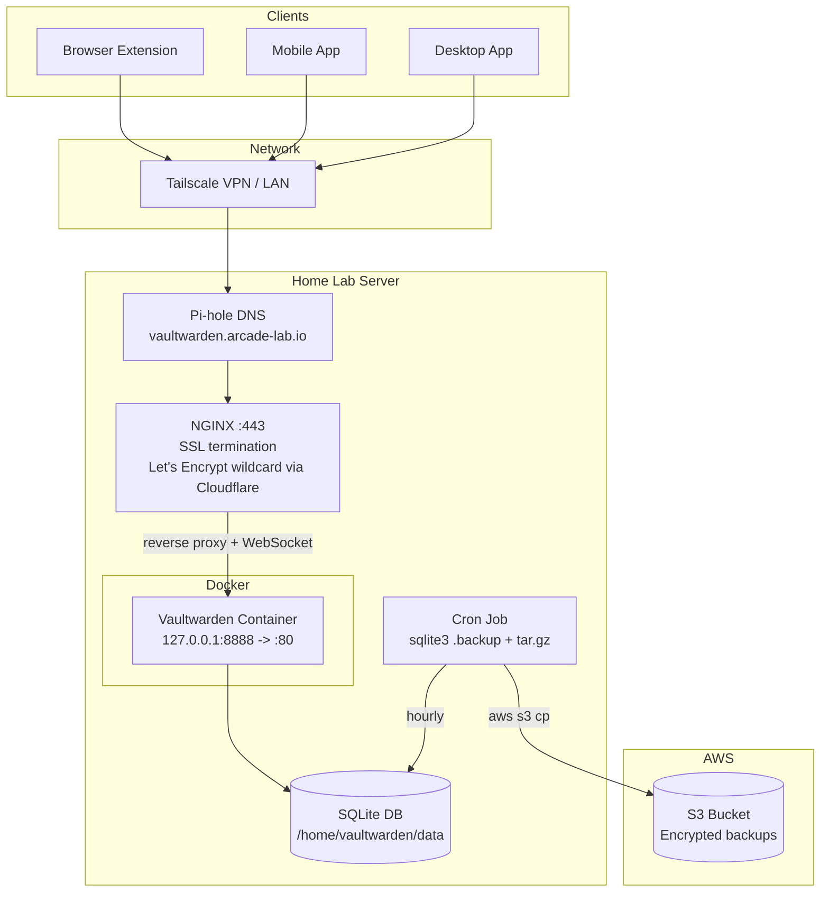
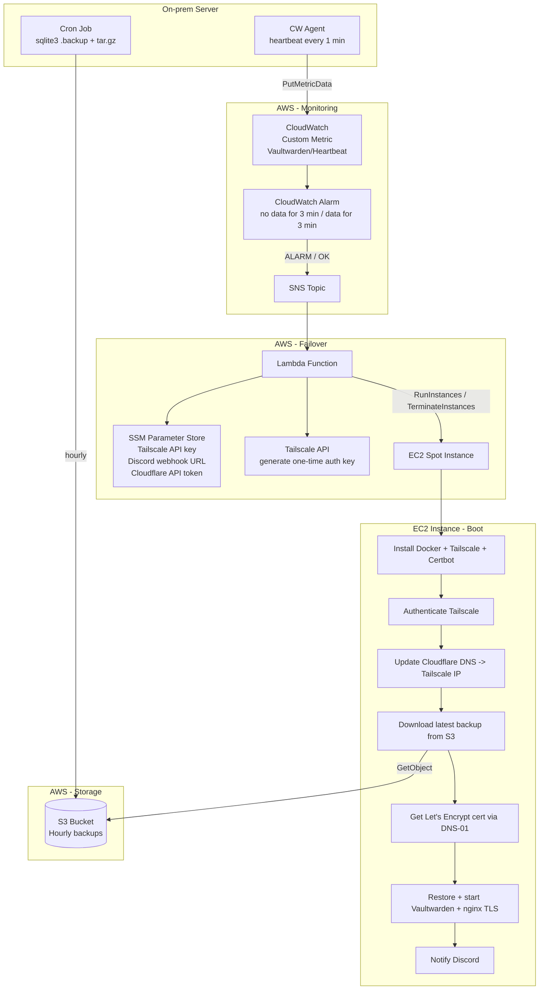

# 🏗️ Building my home server: Part 11

_Self-hosting Vaultwarden with automated disaster recovery_

In my previous post, I added network visibility with NetAlertX. This time I'm tackling something more critical: my password manager. I've been using NordPass, but the whole point of this home lab is owning my own infrastructure. A password manager is the one service where a third-party provider going down (or changing their terms, or getting breached) would lock me out of everything else. Time to bring it home — and build a safety net for when "home" goes down.

## 🔐 What is Vaultwarden?

[Vaultwarden](https://github.com/dani-garcia/vaultwarden) (formerly bitwarden_rs) is a lightweight, self-hosted server compatible with the Bitwarden ecosystem. It implements the Bitwarden API, so you can use all the official clients — browser extensions, mobile apps, desktop apps — while keeping your passwords on your own hardware.

Why not just run the official Bitwarden server? It requires MSSQL and multiple containers. Vaultwarden is a single Rust binary with a SQLite backend that uses ~20-30MB of RAM. For a home lab, it's the obvious choice.

**Why self-host a password manager at all?**

- Full control over your data — passwords never leave your network
- No subscription fees for premium Bitwarden features (TOTP, attachments, organizations)
- Works entirely within a Tailscale VPN or local network
- No dependency on a third-party service's availability or pricing decisions

## 🏗️ Architecture

Vaultwarden runs as a Docker container bound to `127.0.0.1:8888`, sitting behind my existing NGINX reverse proxy with SSL termination (wildcard Let's Encrypt certificate via Cloudflare DNS). Pi-hole provides local DNS resolution for the `vaultwarden.arcade-lab.io` subdomain — the same pattern I use for every other service in the lab.



## 🤖 Ansible Implementation

The deployment is split across the existing Ansible playbook structure. Here's what was created or modified:

| File | Purpose |
|---|---|
| `playbooks/vaultwarden.yml` | Main playbook — creates data directory, runs container |
| `vars/vaultwarden.yml` | Variables: data path, host port, AWS credentials |
| `vars/containers.yml` | Added container name and image (`vaultwarden/server:latest`) |
| `config/nginx.conf.j2` | Added reverse proxy server block with WebSocket support |
| `vars/pihole.yml` | Added `vaultwarden.arcade-lab.io` to local DNS records |

### Container Configuration

The container is locked down with security-focused defaults:

```yaml
image: vaultwarden/server:latest
restart_policy: always
published_ports:
  - "127.0.0.1:8888:80"
volumes:
  - "/home/vaultwarden/data:/data"
env:
  DOMAIN: "https://vaultwarden.arcade-lab.io"
  SIGNUPS_ALLOWED: "false"
  INVITATIONS_ALLOWED: "false"
  SHOW_PASSWORD_HINT: "false"
```

Key decisions:
- **Bound to `127.0.0.1:8888`** — never exposed directly to the network, only reachable through NGINX.
- **`restart_policy: always`** — a password manager should survive reboots without intervention.
- **Signups and invitations disabled** — I created my admin account on first launch, then redeployed with these set to `false`. No one else can register.
- **Password hints disabled** — don't leak hints to unauthenticated users.

### NGINX Reverse Proxy

Two location blocks are needed because Vaultwarden uses WebSockets for live sync notifications (when you save a password on one device, other devices update immediately):

1. `/` — standard reverse proxy for the web vault and API
2. `/notifications/hub` — WebSocket proxy requiring `Upgrade` and `Connection` headers

### Deployment

```bash
ansible-playbook playbooks/vaultwarden.yml
ansible-playbook playbooks/nginx.yml
ansible-playbook playbooks/pihole.yml
```

## 💾 Automated S3 Backups

A password manager without backups is a disaster waiting to happen. The backup strategy uses a dedicated Ansible playbook (`playbooks/backup-vaultwarden.yml`) that installs a backup script and schedules it via cron.

### Setup (runs once via Ansible)

- Installs AWS CLI v2 from the official bundle (architecture-aware, skips reinstall if present)
- Installs `sqlite3` on the host (the Vaultwarden container doesn't ship it)
- Deploys IAM user credentials to `/root/.aws/` (scoped to `s3:PutObject` only)
- Creates the backup script at `/usr/local/bin/backup-vaultwarden.sh`
- Schedules a cron job — hourly, every hour at minute 0

### Backup Script Flow

The script runs every hour and follows this sequence:

1. **Safe database copy** — runs `sqlite3 .backup` against the data directory. This creates a consistent snapshot without stopping Vaultwarden. Important because SQLite WAL mode can corrupt if you just copy the live file.
2. **Stage everything** — copies the entire `/home/vaultwarden/data` directory to `/tmp/vaultwarden-backup`, then swaps in the safe DB copy.
3. **Compress** — creates `vaultwarden_YYYYMMDDHHMMSS.tar.gz`
4. **Upload to S3** — pushes the archive to the backup bucket.
5. **Log** — all steps are logged to `/var/log/backup-vaultwarden.log`.

Failure handling: `set -euo pipefail` aborts on any error, and `trap cleanup EXIT` ensures the temp directory is always cleaned up.

### Retention Strategy

Initially, the script pruned all but the latest backup after each upload — simple but fragile. With hourly backups, I reconsidered:

- **Removed script-level pruning entirely.** The script only uploads now. No `s3:DeleteObject` or `s3:ListBucket` permissions needed, which tightens the IAM policy (principle of least privilege).
- **S3 lifecycle rule set to 3 days.** With hourly backups, this gives ~72 restore points at any time.
- **Why 3 days?** A 1-day window means that if the server goes down and failover doesn't trigger (misconfigured alarm, Lambda bug), all backups could expire before anyone notices. 3 days provides a safety margin while keeping storage costs negligible (~72 backups at ~500KB each).

### AWS Infrastructure (Terraform)

The S3 bucket, IAM user, policy, and access key are managed via Terraform:

```
terraform/
├── versions.tf    # Terraform block, providers, S3 backend
├── provider.tf    # AWS provider with SSO profile
├── variables.tf   # Input variables
├── outputs.tf     # Bucket names, access key (secret marked sensitive)
├── s3.tf          # State bucket (versioned) + backup bucket (3-day lifecycle)
└── iam.tf         # IAM user, inline policy (s3:PutObject only), access key
```

## 🚨 Disaster Recovery

Here's the problem: my home lab server is a single point of failure. If it dies — hardware failure, power outage outlasting the UPS, network issue — there's no access to passwords. For every other service in the lab, downtime is annoying but tolerable. For a password manager, it's a lockout.

The goal: an automated failover system that detects the server is down, launches a standby Vaultwarden on AWS, restores from the latest backup, connects it to the Tailscale network, and notifies me. When the server recovers, the failover instance terminates automatically.

### DR Architecture



### Heartbeat Monitoring

A CloudWatch agent on the home lab server pushes a custom metric (`Vaultwarden/Heartbeat`, value `1`) every 60 seconds. A CloudWatch alarm watches this metric:

- **Alarm condition:** `Sum < 1` for 3 consecutive 1-minute periods (~3 min of silence)
- **`treat_missing_data = "breaching"`** — missing data counts as a failure
- **Alarm actions** → SNS → Lambda (triggers failover)
- **OK actions** → SNS → Lambda (triggers teardown)

One alarm handles both directions. When heartbeats stop, it goes to ALARM and launches failover. When heartbeats resume for 3 consecutive minutes, it transitions to OK and tears down the failover instance.

### Lambda Failover Logic

The Lambda function (Python 3.12) handles two flows based on the alarm state:

**ALARM → Failover:**
1. Check if a failover instance already exists (tag `vaultwarden-failover=active`) — abort if found
2. Read Tailscale API key from SSM Parameter Store
3. Call Tailscale API to generate a one-time, ephemeral auth key (1-hour expiry)
4. Launch EC2 spot instance from launch template, passing the auth key + Discord webhook + S3 bucket via user data
5. Notify via email + Discord: "Failover triggered"

**OK → Automated teardown:**
1. Find failover instance by tag — skip if none found
2. Terminate the instance
3. Notify via email + Discord: "Recovery detected, instance terminated"

### EC2 Failover Instance

The instance boots from a launch template with this user data sequence:

1. Install Docker, nginx, sqlite3, AWS CLI v2, Tailscale, certbot
2. Authenticate Tailscale with the one-time key
3. Update Cloudflare DNS: set `vaultwarden-dr.arcade-lab.io` → Tailscale IP (100.x.x.x)
4. Download and extract the latest backup from S3
5. Obtain a Let's Encrypt certificate via DNS-01 challenge (Cloudflare plugin)
6. Start Vaultwarden container on `127.0.0.1:8080`
7. Configure nginx as TLS reverse proxy (443 → 8080)
8. Post to Discord: "Vaultwarden failover ready at `https://vaultwarden-dr.arcade-lab.io`"

**Why a spot instance?** The failover is by definition short-lived and tolerant of interruption. Spot pricing for t3.micro in eu-central-1 is ~$0.003-0.004/hour vs $0.0104/hour on-demand (60-70% savings). If AWS reclaims the instance, the alarm simply fires again and launches a new one — Vaultwarden data is safe in S3 regardless.

**Why egress-only security group?** No inbound ports are needed. Tailscale handles NAT traversal, so the instance is accessible only through the tailnet. Zero public attack surface.

### Tailscale Key Strategy

Two distinct keys are involved, and their separation is intentional:

1. **API key** (long-lived, stored in SSM) — used only by Lambda to call the Tailscale API. Never leaves AWS.
2. **Auth key** (one-time, ephemeral, generated at failover time) — created via the API with `reusable: false, ephemeral: true` and a 1-hour expiry. Passed to EC2 via user data, consumed on first `tailscale up`, then dead.

Why not just store a pre-generated auth key in SSM? Auth keys expire (max 90 days). If the key expires before a failover happens, the instance can't join the tailnet and the entire DR flow fails silently. Generating at failover time means the key exists for ~5 minutes between Lambda execution and EC2 boot, and can never be reused.

### TLS Strategy

HTTPS is provided via Let's Encrypt certificates obtained through Cloudflare DNS-01 challenge. This avoids needing a paid Tailscale plan for `tailscale cert` and keeps the server accessible only through the tailnet (no public ports). The Cloudflare API token is stored in SSM and retrieved by the instance at boot.

### Terraform Module

All DR infrastructure lives in a separate Terraform module:

```
terraform/vaultwarden-dr/
├── provider.tf          # AWS provider
├── versions.tf          # Terraform + provider versions
├── variables.tf         # All input variables
├── outputs.tf           # Alarm ARN, SNS topic ARN, Lambda ARN
├── cloudwatch.tf        # Alarm (both alarm_actions and ok_actions)
├── sns.tf               # Topics + subscriptions
├── lambda.tf            # Function + SNS trigger
├── ec2.tf               # Launch template (spot) + security group
├── iam.tf               # Lambda role, EC2 instance profile
├── ssm.tf               # Tailscale API key, Discord webhook, Cloudflare token
└── lambda/
    └── failover.py      # Lambda handler
```

## 💰 Cost

### Always-on (no failover)

| Resource | Cost |
|---|---|
| CloudWatch custom metric (1 metric) | $0.30/month |
| CloudWatch alarm (1 alarm) | $0.10/month |
| S3 storage (~72 backups at ~500KB) | ~$0.01/month |
| S3 PUT requests (~720/month) | ~$0.004/month |
| Lambda, SNS, SSM | $0 (free tier) |
| **Total** | **~$0.42/month** |

### During failover

| Resource | Cost |
|---|---|
| EC2 t3.micro spot | ~$0.003-0.004/hour (~$2.50/month) |
| EC2 on-demand equivalent | $0.0104/hour (~$7.50/month) |

The EC2 cost only applies while the failover instance is running — it's automatically terminated once the home server recovers.

## 🔄 Recovery Flow

When the on-prem server comes back online:

1. CloudWatch agent resumes sending heartbeats
2. After 3 consecutive minutes of data, the alarm transitions to OK
3. Lambda terminates the failover EC2 instance automatically
4. Email + Discord notifications confirm recovery
5. **Manual step (if needed):** export any new vault entries created during the failover period and import to on-prem

Automatic failback of Vaultwarden data is intentionally not implemented — it would risk split-brain scenarios where entries were modified on both instances simultaneously.

## 🎉 Outcome

With this setup, I have:

1. **Self-hosted password management** — all credentials stay on my own hardware, accessible through the standard Bitwarden clients via Tailscale.
2. **Hourly backups to S3** — maximum 1 hour of data loss in a worst-case scenario, with 72 restore points available at any time.
3. **Automated failover in ~5 minutes** — if the server goes down, a standby Vaultwarden is live on AWS before I'd even notice the outage.
4. **Automated teardown** — no manual cleanup needed when the server recovers.
5. **Sub-dollar monthly cost** — the monitoring infrastructure costs ~$0.42/month. Failover compute is only billed while active.
6. **Zero public attack surface** — both the on-prem and failover instances are accessible only through Tailscale, with no inbound ports open to the internet.

The home lab server is still a single point of failure for compute, but it's no longer a single point of failure for access to my passwords. That's the difference between "my server is down, I'll fix it later" and "my server is down and I can't log into anything."

Noice! 🎉
