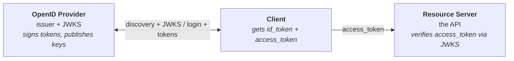
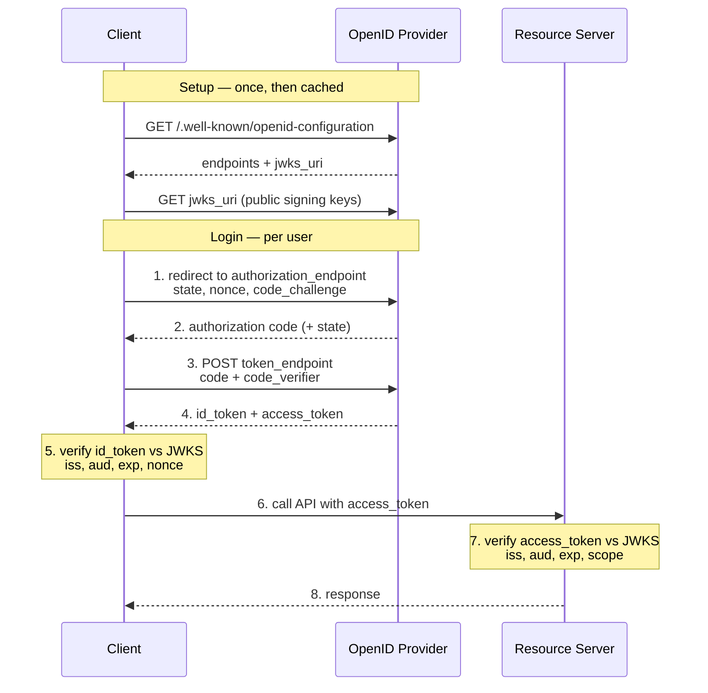
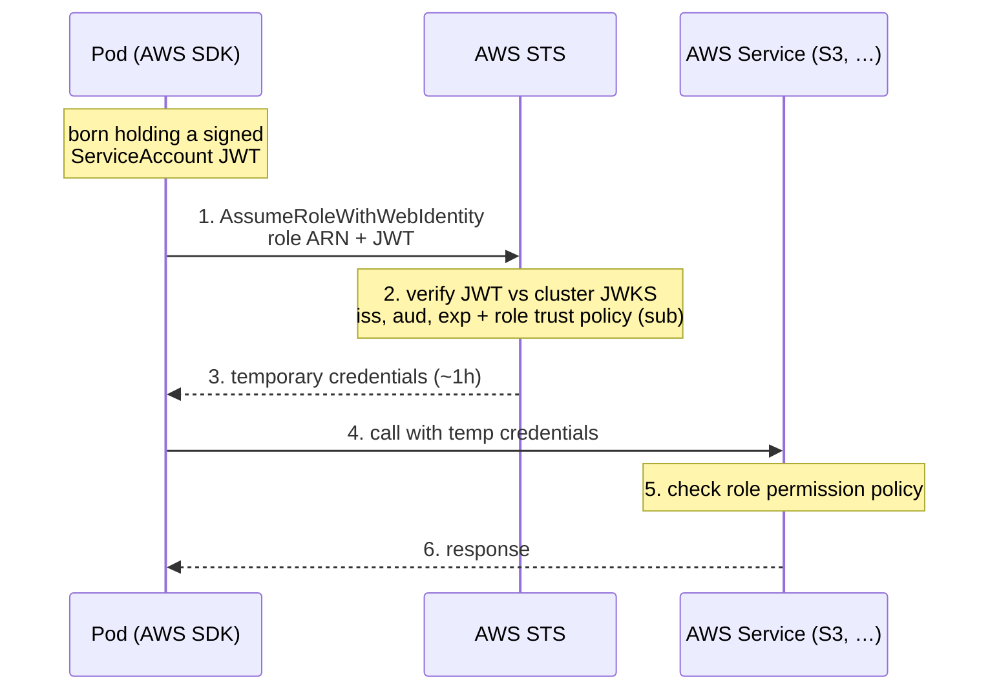
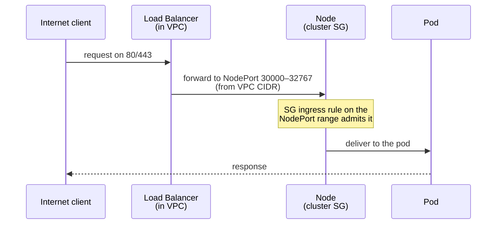

# 🔑 Dev Platform: Teaching AWS to Trust My Cluster

_Milestone 2, part one: IRSA without the magic — OIDC from first principles, and hosting my own OpenID provider on an S3 bucket_

## 🎯 What I was trying to do

[Part 2](/blog/29) ended with a quiet, correct foundation: encrypted secrets, CI gates, and Cilium doing the networking. Nothing on the cluster yet that needs to reach out of it.

That changes now. The platform services I'm about to install — the EBS CSI driver, the AWS Load Balancer Controller, Velero — all need to call the **AWS API**. The EBS driver creates volumes, the LB controller spins up NLBs, Velero writes backups to S3. And AWS only authenticates **IAM identities**; it has no idea what a "Kubernetes pod" is.

The lazy answer is to create an IAM user, generate an access key, and drop it into the cluster as a Secret. Long-lived static credentials that never rotate and leak the moment anyone gets read access to a namespace. The right answer is **IRSA** — IAM Roles for Service Accounts — where a pod proves who it is with a short-lived token and gets temporary credentials, no static key anywhere.

I knew the words. I did not actually understand the mechanism. So before writing a line of Terraform, I made myself learn it properly — and that turned out to be the real content of this milestone.

---

## 🧩 The thing I had to understand first: OIDC

Every IRSA explanation I found assumed you already understood OIDC. What made it click for me was ignoring the provider details and thinking of it as three roles passing a signed token: the **client** (app), the **OpenID Provider** (issues and signs tokens), and the **resource server** (the API).



### Setup — discovery, before any login

On startup, the client reads the provider's config from a well-known URL (cached afterwards, so this isn't part of the per-login flow):

```
GET https://<issuer>/.well-known/openid-configuration
→ { "issuer": "...", "authorization_endpoint": "...",
    "token_endpoint": "...", "jwks_uri": "..." }
```

Four fields carry the whole flow:

- `issuer` — the provider's identity; must exactly match the `iss` claim inside the tokens it hands out.
- `authorization_endpoint` — where the client sends the user to log in.
- `token_endpoint` — where the client swaps the authorization code for tokens.
- `jwks_uri` — where the provider publishes its **public** signing keys; this is the one that matters later, and the client fetches and caches it too.

(For IRSA, only `issuer` and `jwks_uri` end up mattering — there's no interactive login, so the two endpoints go unused.)

### The auth flow — Authorization Code + PKCE

Now the per-login flow. The modern, correct version carries three pieces of anti-abuse machinery, and skipping any one of them is a real vulnerability.

**1. The client starts the login.** Before redirecting, it generates three short-lived values and stores them (a server-side session behind an `HttpOnly` cookie for a confidential client; `sessionStorage` for a SPA with no backend):

- `state` — random, returned unchanged at the end. Ties the callback to **this** browser session, defeating CSRF / forged callbacks.
- `nonce` — random, must reappear **inside** the returned ID token, defeating **replay** (reusing a genuine token issued during another login).
- a **PKCE** pair — a secret `code_verifier` and its SHA-256 hash `code_challenge`. Only the **hash** is sent now.

It redirects the browser to the **authorization endpoint**:

```
GET <authorization_endpoint>
    ?response_type=code&client_id=...&redirect_uri=...
    &scope=openid&state=<state>&nonce=<nonce>
    &code_challenge=<hash>&code_challenge_method=S256
```

**2. The user authenticates** on the provider's page (and may grant consent). The provider redirects back to `redirect_uri` with a one-time authorization `code` and the original `state`. The client first checks `state` matches what it stored — if not, drop it.

**3. The client exchanges the code for tokens** on the back channel (server-to-server), revealing the PKCE secret now:

```
POST <token_endpoint>
    grant_type=authorization_code&code=<code>
    &code_verifier=<secret>&redirect_uri=...
    &client_id=...            # + client_secret for a confidential client
→ { "id_token": "...", "access_token": "...", "refresh_token": "..." }
```

PKCE is what makes a stolen `code` worthless: whoever intercepts it can't redeem it without the `code_verifier`, which never travelled over the wire. `state` protects the **callback**; PKCE protects the **code**.

**4. Two tokens come back, and they are not the same thing** — the distinction that took me longest:

- The **ID token** proves **who the user is**, and it's for the **client**. The client validates it (signature against the cached JWKS, plus `iss`, `aud`, `exp`, and the `nonce` it sent), reads the `sub` claim, and establishes its own session.
- The **access token** authorizes **API calls**, and it's intended for the **resource server**. Clients typically treat it as a credential and attach it when calling the API rather than relying on its contents.

**5. The client calls the API** with the access token, and the **resource server** validates it independently — signature against the same JWKS, then `iss`, `aud`, `exp`, `nbf`, algorithm, often `scope` — and only then serves the request.

The whole exchange, end to end:



So the protocol is: an **OpenID Provider** signs tokens; a **relying party** verifies them against the provider's published public keys (the client for the ID token, the resource server for the access token); and a small kit of `state` + `nonce` + PKCE keeps a token from being stolen or forged as it passes through a hostile browser. That last clause turns out to be the key to understanding IRSA — because IRSA has **no** browser.

---

## 🔁 IRSA is just OIDC with the actors swapped

Once the OIDC flow clicked, IRSA stopped being mysterious. It's the **exact same protocol** — only the cast changes:

| OIDC concept | IRSA equivalent |
|---|---|
| Client | the app running in the pod (typically via the AWS SDK) |
| OpenID Provider | the Kubernetes API server (the cluster's OIDC issuer) |
| JWT | the pod's Kubernetes ServiceAccount token |
| Token consumer | AWS STS |
| Resource | AWS services (S3, DynamoDB, Secrets Manager, …) |

And here's where the "no browser" point pays off: IRSA throws away all the redirect machinery. No `state`, no PKCE, no authorization code — that kit only exists to protect a token bouncing through a user's browser, and here there is no user and no browser. A pod is simply **born holding** a token signed by the cluster, mounted straight into it. What's left is the short back half of OIDC:

1. The pod receives a Kubernetes ServiceAccount **JWT**, projected into it (`sub` = its ServiceAccount, `aud` = `sts.amazonaws.com`).
2. The app — usually the AWS SDK — reads that token.
3. It calls **`AssumeRoleWithWebIdentity`** on AWS STS, handing over the role ARN and the token.
4. **STS validates the token**: signature against the cluster's JWKS, then `iss`, `aud` (`sts.amazonaws.com`), `exp`, and the role's **trust policy** — e.g. the `sub` claim matches the expected ServiceAccount.
5. If everything matches, STS issues **temporary AWS credentials** (~1h).
6. The app uses those credentials to call AWS services — and **that** call is gated separately, by the role's **permission policy**.



The two corrections I had to make to my own mental model:

**The direction of trust is backwards from the intuition.** AWS never connects **into** my cluster. The pod reaches **out** to AWS, and AWS reads the public keys from a bucket. The cluster is the identity provider; AWS is the verifier. Nothing about the cluster is exposed — only a couple of public-key files.

**There are two enforcement moments, not one.** Getting credentials and using them are gated by **different** policies:

- **Trust policy** (checked at STS) — **who may assume this role?** Scoped to one exact ServiceAccount via the `sub` claim.
- **Permission policy** (checked at the EC2/S3 API, later) — **what may this role do?** e.g. `ec2:CreateVolume`.

STS doesn't know or care that the pod wants EBS; it just returns generic role credentials. Whether those creds can touch EBS is decided **when they're used**, by the permission policy. Collapsing those two into "the token lets it use EBS" is the mistake.

---

## 🪣 The hard part: being my own OpenID provider

First, the question that had been nagging me: **why can't AWS just ask my API server directly?** Because STS verifies tokens *independently* — it can't phone my cluster on every `AssumeRoleWithWebIdentity` call (that's millions of pods across every AWS customer, and my API server isn't reachable from AWS anyway). Instead it does what any OIDC verifier does: fetch the provider's **public signing keys once**, cache them, and check token signatures locally. So AWS never needs to reach *into* my cluster — it only needs my public keys sitting somewhere it can read.

On managed EKS, AWS hosts your cluster's OIDC discovery document and JWKS for you. On my self-managed Talos cluster, nobody does. The API server **can** serve those documents — but only on a private, in-cluster endpoint that AWS's STS servers on the public internet cannot reach.

So I have to publish them myself, somewhere public over HTTPS. That "somewhere" is a **public-read S3 bucket** holding two files:

- `/.well-known/openid-configuration` — the discovery document
- the JWKS — the cluster's **public** signing keys

This looks alarming and `tfsec` will yell, but it's fine anyway: the bucket holds only public signing keys and OIDC metadata — data that **exists** to be fetched by anyone. There's nothing secret to leak.

The flow at runtime is the same two-hop lookup any OIDC verifier does, just pointed at my bucket:

```
1. STS GET  <bucket>/.well-known/openid-configuration    → reads "jwks_uri"
2. STS GET  <whatever jwks_uri says>                     → fetches public keys
3. verify the pod token's signature + iss/aud/sub/exp
```

---

## 🔗 The insight that untangled the bootstrap

Here's the part that looked circular and isn't. For the tokens to validate, three strings have to be **byte-identical**:

1. the API server's `--service-account-issuer` (becomes the `iss` claim baked into every pod token)
2. the `issuer` field in the published discovery doc
3. the `url` on the AWS OIDC provider

And `--service-account-issuer` has to be set at **cluster bootstrap**, in the Talos machine config — **before** the bucket exists. So how can the apiserver point at a bucket I haven't created?

Because the bucket URL is **deterministic**. It's:

```
https://dev-platform-oidc-<account-id>.s3.<region>.amazonaws.com
```

The account id comes from a data source (known at plan time), the region is fixed, the bucket name is a string I chose. None of it requires the bucket to exist. So I compute the URL once in a `local` and feed it to both the Talos config and the bucket:

```hcl
locals {
  oidc_bucket = "dev-platform-oidc-${data.aws_caller_identity.current.account_id}"
  oidc_issuer = "https://${local.oidc_bucket}.s3.${data.aws_region.current.region}.amazonaws.com"
}
```

Then the apiserver gets it as `extraArgs` in the controlplane machine config:

```hcl
extraArgs = {
  service-account-issuer   = local.oidc_issuer
  service-account-jwks-uri = "${local.oidc_issuer}/openid/v1/jwks"
  api-audiences            = "sts.amazonaws.com,${local.oidc_issuer}"
}
```

No cycle — the URL is known before any resource is built. The bucket just has to be created **at** that predictable address later.

That last line, `api-audiences`, is a trap I'd have walked straight into. The moment you set `service-account-issuer`, `api-audiences` silently **defaults to that issuer** — which means a pod requesting a token with `aud=sts.amazonaws.com` gets rejected. You have to list **both**: `sts.amazonaws.com` (so IRSA works) and the issuer (so normal in-cluster tokens keep working). Nothing tells you this; IRSA just fails with an audience error while every file looks correct.

---

## 🪣 The OIDC bucket

`06-s3.tf` stands up the one bucket that turns the cluster into a public OIDC provider — `dev-platform-oidc-<account-id>` — and puts exactly two files in it, nothing else:

- **`/.well-known/openid-configuration`** — the discovery document. OIDC fixes this exact path (no file extension); a verifier hits it first to learn where the keys live.
- **`openid/v1/jwks`** — the JWKS, the cluster's **public** signing keys. This path matches the `jwks_uri` the discovery doc advertises, which in turn matches the apiserver's `--service-account-jwks-uri`. All three have to name the same location or verification 404s.

The bucket is deliberately **public-read**, because STS fetches these anonymously — that means disabling S3 Block Public Access **and** a bucket policy granting `s3:GetObject` to principal `"*"` (granting it to my own account wouldn't help; the verifier isn't authenticated as me):

```hcl
principals {
  type        = "*"
  identifiers = ["*"]
}
```

The two files aren't committed to the repo — they're generated by the running cluster. A `null_resource` pulls them out at apply time (via `kubectl get --raw`) and two `aws_s3_object` resources upload them to the paths above.

There's a **second** bucket in this milestone — `dev-platform-velero-<account-id>`, private, for backups — but that one belongs with Velero, so it shows up further down.

---

## 🎫 The roles — two policies, two gates

With the bucket serving the cluster's public keys, the AWS side can finally consume them. First the provider — the one-liner that says "AWS, trust tokens from this cluster":

```hcl
resource "aws_iam_openid_connect_provider" "irsa_oidc_provider" {
  url            = local.oidc_issuer
  client_id_list = ["sts.amazonaws.com"]
}
```

`client_id_list` confused me at first — it's the OIDC **audience** (`aud`), and AWS just kept the OAuth name. For IRSA the audience is always `sts.amazonaws.com`, because the token is a message addressed **to STS**. That string has to agree in four places — the apiserver's `api-audiences`, the pod's token request, this list, and the role condition below — or it silently fails.

The provider does nothing on its own, though. The real work is the **roles**, and the thing that finally made IRSA concrete for me is that every role carries **two completely different policies**:

- a **trust policy** — **who may assume this role** — built in to the role itself, exactly one.
- a **permission policy** — **what the role may do once assumed** — attached separately, zero or more.

The trust policy is the IRSA-specific half:

```hcl
data "aws_iam_policy_document" "ebs_csi_assume" {
  statement {
    effect  = "Allow"
    actions = ["sts:AssumeRoleWithWebIdentity"]
    principals {
      type        = "Federated"
      identifiers = [aws_iam_openid_connect_provider.irsa_oidc_provider.arn]
    }
    condition {
      test     = "StringEquals"
      variable = "${replace(local.oidc_issuer, "https://", "")}:sub"
      values   = ["system:serviceaccount:kube-system:ebs-csi-controller-sa"]
    }
    # ...same again for :aud = sts.amazonaws.com
  }
}
```

Two details I learned the hard way reading it back. AWS stores the provider keyed by the issuer URL with **`https://` stripped**, so the condition key has to be `replace(local.oidc_issuer, "https://", "")` — and the **variable name itself** is computed, which looks odd until you realize the prefix is the issuer. And that `sub` value isn't arbitrary: `system:serviceaccount:<namespace>:<name>` is a fixed Kubernetes format, and `ebs-csi-controller-sa`/`kube-system` are the EBS CSI chart's defaults. I'm writing a **promise** here that the ServiceAccount I install in M4 will have exactly that name and namespace — and be annotated with this role's ARN. The trust policy is one side of a handshake whose other side doesn't exist yet.

The permission half, for EBS CSI, is mercifully a one-liner — AWS publishes a managed policy:

```hcl
resource "aws_iam_role_policy_attachment" "ebs_csi" {
  role       = aws_iam_role.ebs_csi.name
  policy_arn = "arn:aws:iam::aws:policy/service-role/AmazonEBSCSIDriverPolicy"
}
```

The literal `aws` in the account slot of that ARN (`iam::aws:policy`) is what marks it AWS-managed rather than mine. The LB controller and Velero won't be so lucky — their policies are a committed JSON file and a hand-written one respectively. But the shape is now fixed: trust policy gates the entry, permission policy gates the actions, two gates per role.

### The other two roles — writing the permissions myself

EBS CSI got a managed policy for free. The Load Balancer Controller and Velero don't have one, and the two of them turned out to demonstrate the two ways you end up supplying the permission half yourself.

The LB Controller's policy is large and maintained upstream by AWS, so hand-writing it would be a mistake — I commit their published JSON into the repo and load it from disk:

```hcl
resource "aws_iam_policy" "aws_lbc" {
  name   = "dev-platform-aws-lbc"
  policy = file("${path.module}/policies/aws-lbc-iam-policy.json")
}
```

`file()` reads at plan time, and the JSON lives under version control — which is the whole point of committing it rather than curling it during apply: when I bump the controller version I can **diff** the policy and see exactly which permissions changed.

Velero's is small enough to write by hand, and writing it forced me to finally learn a distinction I'd always fudged — that S3 permissions target two different kinds of resource:

```hcl
data "aws_iam_policy_document" "velero" {
  statement { # EC2 snapshots — resource is the whole account
    actions   = ["ec2:CreateSnapshot", "ec2:DeleteSnapshot", "ec2:CreateVolume", ...]
    resources = ["*"]
  }
  statement { # object ops — scoped to *inside* the bucket
    actions   = ["s3:GetObject", "s3:PutObject", "s3:DeleteObject", ...]
    resources = ["${aws_s3_bucket.velero.arn}/*"]
  }
  statement { # listing — scoped to the bucket *itself*
    actions   = ["s3:ListBucket"]
    resources = [aws_s3_bucket.velero.arn]
  }
}
```

Object actions like `GetObject` act on `bucket/*`; `ListBucket` acts on the bucket ARN **without** the `/*`, because listing is an operation on the container, not on an object inside it. Get those the wrong way round and Velero can read files but not list them, or list but not read.

---

## 🔌 The rest of M2: tags, ports, and a bucket to protect

The roles are the interesting half. The other half of "make AWS ready" is unglamorous plumbing that's easy to get subtly wrong — which I duly did.

**VPC tags that are secretly load-bearing.** The LB Controller doesn't take a list of subnets — it **discovers** them by scanning the VPC for magic tags:

```hcl
"kubernetes.io/role/elb"             = "1"      # put internet-facing LBs here
"kubernetes.io/cluster/dev-platform" = "owned"  # this subnet belongs to my cluster
```

Nothing in my Terraform **reads** these — the reference lives inside a controller I haven't installed yet (the exact keys and their meaning are in the LB Controller's [subnet auto-discovery docs](https://kubernetes-sigs.github.io/aws-load-balancer-controller/latest/deploy/subnet_discovery/)). Which makes them exactly the kind of line a future me would "tidy up," then spend an hour wondering why every Ingress fails with `couldn't auto-discover subnets`. They got a comment — and that doc link — explaining what breaks without them.

**Security-group rules that follow the traffic.** Once an LB exists, traffic flows internet → LB on 80/443 → a NodePort (30000–32767) on the node. The node's security group has to admit that forwarded traffic, so it needs an **ingress** rule on the NodePort range from inside the VPC — that's the rule doing the real work, since the LB lives in the VPC CIDR and forwards to those ports. The public 80/443 ingress is belt-and-suspenders for the case where a node is ever exposed directly rather than behind an LB.



**A bucket I don't want to be able to delete.** Velero's backups live in their own S3 bucket, and the one new mechanic here was protecting it:

```hcl
resource "aws_s3_bucket" "velero" {
  bucket = local.velero_bucket   # dev-platform-velero-<account-id>
  lifecycle {
    prevent_destroy = true
  }
}
```

`prevent_destroy` makes `terraform destroy` **fail** rather than quietly take my backups with it — and it has to be a literal, you can't compute it.

---

## 📝 What I'll remember

**Learn the protocol, not the product.** I could have copy-pasted an IRSA Terraform module and moved on. Spending a day on OIDC-from-first-principles instead means IRSA, EKS's hosted version, and "Log in with Google" are now **the same thing** in my head — and when it breaks, I can reason about it instead of pattern-matching against a tutorial.

**Most IRSA bugs are one question asked four times.** "Could an anonymous caller fetch this URL and trust the result?" The public-read policy, the discovery path, the `jwks_uri` match — all the same question, all silent failures that look correct in the file.

**The defaults that bite hardest are the ones that change under you.** `api-audiences` defaulting to the issuer the instant you set the issuer is the kind of thing you only learn by reading the flag docs or by losing an afternoon. I'd rather write it down than relearn it.

**`depends_on` orders apply, not plan.** `filemd5()` reads at plan time; no dependency edge can save you. Knowing **when** each expression is evaluated is half of debugging Terraform.

**Every IRSA role has two policies, and they answer different questions at different moments.** Trust policy: **who may become this role?** (checked by STS when getting credentials). Permission policy: **what may this role do?** (checked by EC2/S3 when using them). Once that split clicked, the whole thing stopped being one blurry "permissions" concept.

**The lines that need comments are the ones whose "reference" lives in another system.** The subnet tags, the `sub` claim, the apiserver flags — none of them point at anything inside my Terraform; each is a promise to a controller, to STS, to a chart I haven't installed. Those are exactly the lines a cleanup pass would delete, because nothing local explains why they can't be. Comment those; leave the CIDRs and route tables alone.

---

## 💭 Where this leaves me

M2 is **applied and verified** — and not on a cluster I'd been nursing along, but on one brought up **from scratch**. The issuer change lives in the control-plane machine config, so it isn't a hot-patch: the whole cluster boots into this identity. Talos writes the config, Cilium takes over networking, the apiserver comes up already stamping the S3 bucket URL as its issuer, and the discovery doc plus keys get pushed to the public bucket. AWS is registered to trust it, and all three IRSA roles exist — EBS CSI on a managed policy, the LB Controller on a committed JSON policy, Velero on a hand-written one — alongside the network tags, ingress rules, backup bucket, and outputs the platform services will need.

The moment I was waiting for is one command asking the apiserver to confirm what it's advertising:

```bash
kubectl get --raw /.well-known/openid-configuration | jq '.issuer, .jwks_uri'
```

Both echo my S3 bucket URL. Then the same URL, fetched **anonymously** from the public bucket, returns the identical discovery doc and a `keys` array — because that's exactly the path AWS STS will take, with no credentials, when it validates a pod's token. That round-trip is the whole milestone answering back: the cluster now claims an identity the outside world can verify without ever talking to it.

Then M3 — Argo CD as the seed that reconciles the platform from Git. But the IRSA handshake still only **completes** in M4, when the real ServiceAccounts get created and annotated with these ARNs. Everything I built in M2 is one side of a contract, waiting for the other. To be continued.
