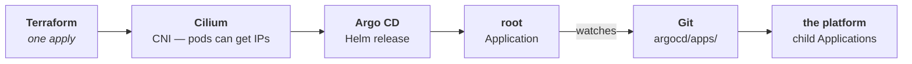
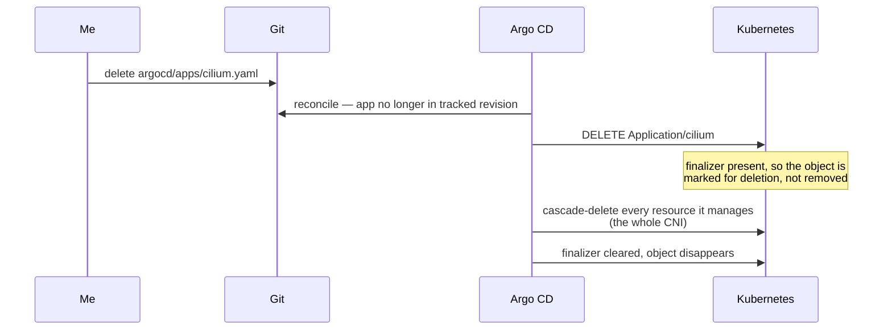

# 🎛️ Dev Platform: Handing the Cluster to Argo CD

_Milestone 3: seeding Argo CD with Terraform, the App-of-Apps root, and the CNI handover that cost me an outage_

## 🎯 What I was trying to do

[Part 3](/blog/irsa-without-eks-self-hosted-oidc) left the cluster holding a verifiable identity: its own OIDC issuer on a public S3 bucket, three IAM roles waiting for ServiceAccounts that don't exist yet. Everything built so far arrived the same way — `terraform apply`.

M3 is where that stops. The goal is a cluster that reconciles **itself** from Git, so Terraform's last act on the cluster is installing the tool that replaces it. After M3, Terraform owns AWS and the nodes; Argo CD owns everything running on them.

Which means the milestone is really one design question: **how little can Terraform install and still have the rest arrive on its own?**

The answer is Argo CD plus exactly one Argo CD object. That object — the `root` Application — points at a directory in this repo, and every child Application discovered there brings in a piece of the platform. That's the **App-of-Apps** pattern, and it's the last thing I have to write by hand.

I expected the interesting part to be the App-of-Apps wiring. It wasn't. The wiring took an afternoon. What took the rest of the time was discovering that one of the components I'd planned to hand over to Argo CD **cannot be handed over at all** — and finding that out the expensive way.

---

## 🥾 The bootstrap paradox

A GitOps platform has an ordering problem at the very bottom. Argo CD reconciles the cluster from Git, but Argo CD is itself a workload — it needs a cluster that can already schedule pods, and pods need a CNI. So the first few layers can't come from Git; something outside the cluster has to place them.

That "something" is Terraform, and the chain looks like this:



Everything left of `root` is the **seed**. Everything right of it is reconciled forever after. The seed is the part you want as small as possible, because it's the part that isn't self-healing — nothing watches it, nothing corrects drift in it, and it only runs when I type a command.

The root Application itself is deliberately boring:

```yaml
spec:
  source:
    repoURL: https://github.com/denesbeck/dev-platform.git
    targetRevision: main
    path: argocd/apps
    directory:
      recurse: true
  syncPolicy:
    automated:
      prune: true
      selfHeal: true
```

`recurse: true` means every YAML under `argocd/apps/` becomes a child. `prune: true` means deleting a file deletes what it created. Adding a platform component from here on is one file in one directory — which is the entire point, and also, as I'd find out, the sharpest edge in the whole design.

---

## 🪤 The Terraform resource that can't bootstrap anything

My first attempt at the root Application used `kubernetes_manifest`, which is the obvious tool: it applies an arbitrary Kubernetes object from Terraform.

It fails, and it fails in a way worth understanding, because the failure is structural rather than a bug:

```
Error: Failed to determine GroupVersionResource for manifest
cannot select exact GV from REST mapper
```

`kubernetes_manifest` fetches the resource's OpenAPI schema **from the API server at plan time** so it can type-check the object you wrote. That's a genuinely nice feature — you get told about a typo'd field before anything is applied. But it means the resource has a hard requirement: the CRD must already be registered on a reachable cluster **when you plan**.

On a cold bootstrap, at plan time, there is no cluster. And even once there is, the `argoproj.io` CRDs only appear midway through the same apply that's trying to plan this object. The dependency is circular in time: `depends_on` can order *apply*, but it cannot order *plan*.

This is the same shape of trap as the `filemd5()` problem from M2 — the fix isn't a dependency, it's moving the work into a phase where the information exists. `helm_release` does all of its work at apply time and never asks the API server anything during plan. So I wrapped the single Application in a throwaway local chart:

```
terraform/charts/argocd-root-app/
├── Chart.yaml
├── values.yaml
└── templates/root-app.yaml
```

and installed it as a Helm release:

```hcl
resource "helm_release" "argocd_root_app" {
  name      = "argocd-root-app"
  chart     = "${path.module}/charts/argocd-root-app"
  namespace = kubernetes_namespace.argocd.metadata[0].name

  depends_on = [helm_release.argocd]  # the argoproj.io CRDs ship with it
}
```

A one-template chart to install one object is not elegant. But it's the difference between a cold `terraform apply` that works on an empty AWS account and one that requires the cluster to already exist — and "works from nothing" is the property I actually care about.

---

## ♻️ Argo CD managing Argo CD

Terraform installs Argo CD. Then the first child Application, at sync wave `-1`, is Argo CD **adopting the release Terraform just installed**. Not a second copy — the same Helm release, now reconciled from Git.

Two details make that work.

**Wave -1.** If Argo CD upgrades itself in the middle of reconciling ten other apps, the controller restarts mid-flight and the rest of the sync is anyone's guess. Putting self-management first means the upgrade — if there is one — happens while nothing else is in progress.

**Server-side apply.** The Argo CD chart ships CRDs that are larger than the 262144-byte annotation limit Kubernetes imposes on `last-applied-configuration`. Client-side apply stores the whole object in that annotation, so it simply cannot apply them:

```yaml
syncOptions:
  - ServerSideApply=true
```

But the real problem with self-management is subtler, and it's about **duplication**. Terraform needs the values to install the release. Argo CD needs the same values to adopt it. If they differ by one line, the first sync isn't an adoption — it's an immediate self-upgrade to whatever Git says, on a cluster I've just built and haven't verified.

So before applying anything, I rendered both value sources and diffed them resource by resource: 44 rendered resources from the Terraform values, 44 from the chart's, byte-identical. Adoption would be a genuine no-op.

That diff also caught something I'd otherwise have shipped. I had written:

```yaml
applicationSet:
  enabled: false
```

on the reasonable assumption that a chart with an `applicationSet` block has an `enabled` flag in it. Chart 10.x doesn't — the ApplicationSet controller always installs, and the key I set was silently ignored. A flag that does nothing renders exactly like a flag that works; only diffing the output showed the Deployment still there. Since I can't switch it off, I capped its requests and limits instead and corrected the comment that claimed otherwise.

**The part I fixed later.** Keeping two copies of the same values byte-identical is a discipline problem, and discipline problems eventually lose. So the two files became one: `argocd/platform/argocd/values.yaml` is now the only place Argo CD's configuration exists, and Terraform reads it off disk.

```hcl
locals {
  argocd_chart_dir = "${path.module}/../argocd/platform/argocd"

  # Helm nests subchart values under the dependency name; helm_release wants
  # them flat, so unwrap that one key.
  argocd_values = yamldecode(file("${local.argocd_chart_dir}/values.yaml"))["argo-cd"]

  argocd_chart_version = one([
    for dep in yamldecode(file("${local.argocd_chart_dir}/Chart.yaml")).dependencies :
    dep.version if dep.name == "argo-cd"
  ])
}
```

The chart version comes from the same chart's `Chart.yaml`, so that can't drift either. Terraform's only transformation is stripping the `argo-cd:` subchart wrapper — everything else is passed through untouched, which makes "the seed matches what Argo CD adopts" true **by construction** instead of true by remembering.

---

## 🔐 Teaching repo-server to decrypt

M0 encrypted the repo's secrets with SOPS and age. M4 is the first milestone that actually commits one — a Cloudflare API token for cert-manager. For that to work, the component that renders manifests, `repo-server`, needs the `sops` binary and the age private key.

The binary is easy: an init container drops a static build onto a shared `emptyDir`, and the main container mounts one file out of it.

```yaml
volumeMounts:
  - name: custom-tools
    mountPath: /usr/local/bin/sops
    subPath: sops
```

`subPath` is doing real work there. Without it, mounting a volume at `/usr/local/bin` **shadows the entire directory** and every other binary in it disappears. With `subPath`, a single file is grafted into the existing directory and nothing else changes.

The key is the interesting half, because it's the one thing in this whole design that **cannot** live in Git. The repo's secrets are encrypted to this key; storing the key in the repo — even encrypted to itself — is circular. So Terraform creates it as a Secret, from a variable, and Argo CD never manages it:

```hcl
resource "kubernetes_secret" "sops_age_key" {
  metadata {
    name      = local.sops_secret_name
    namespace = kubernetes_namespace.argocd.metadata[0].name
  }
  data = { "keys.txt" = var.sops_age_key }
}
```

with `mode 0444` on the mount and `SOPS_AGE_KEY_FILE` pointing at it. That variable has a consequence worth stating plainly: Terraform writes variable values into state, so **anyone holding `terraform.tfstate` holds the age key**. The state file is gitignored for the same reason `*.tfvars` is.

The verification I insisted on here was a real round-trip, not a smoke test. "The binary exists" proves nothing about whether the key is readable, correctly formatted, or found at all. So the check encrypts a scratch file and decrypts it again, inside the running pod:

```sh
kubectl -n argocd exec "$POD" -c repo-server -- sh -c \
  'echo "k: v" | sops --encrypt --age "$RECIPIENT" /dev/stdin | sops --decrypt /dev/stdin'
```

If that prints `k: v`, the whole path works.

---

## 🧨 The handover that cost me an outage

Here's the plan I'd written for myself back in M1, and it sounds completely reasonable:

> Cilium is installed by Terraform because the cluster needs a CNI before anything else can run. In M3, let Argo CD adopt it, then `terraform state rm helm_release.cilium` so there's exactly one owner.

I did the adoption work properly. It even surfaced two nice Helm details.

**Helm drops null-valued keys when it coalesces subchart values.** Wrapping the Cilium chart in an umbrella chart made three keys vanish from the rendered `cilium-config` ConfigMap — `debug-verbose`, `policy-cidr-match-mode`, `nodeport-addresses`. All three are guarded by `hasKey` in the chart's templates and all three default to null, so coalescence removed them entirely and the guard then skipped them. Setting them explicitly to empty values brought them back.

**The Cilium chart mints a fresh CA every time you render it.** `cilium-ca`, `hubble-server-certs` and `hubble-relay-client-certs` are generated at template time. Under Argo CD that means every single reconcile produces new certificates, rotating the CA out from under Hubble's mTLS. That needs `ignoreDifferences` plus `RespectIgnoreDifferences=true` — or, properly, cert-manager owning them, which is M4's job.

So: 26 of 29 resources identical, the three differences being exactly those certificate Secrets. Adoption verified. Then I went to do the `state rm` and the plan fell apart in both directions at once.

**`state rm` doesn't work.** Removing the resource from state doesn't remove it from the *configuration* — `05-cilium.tf` still declares `helm_release.cilium`. The next apply sees a resource it doesn't have in state, tries to create it, and hits a Helm release name that already exists: `cannot re-use a name that is still in use`.

**Deleting the file doesn't work either.** A cold bootstrap onto an empty cluster has to install the CNI *before* Argo CD can schedule a single pod. If Terraform doesn't own Cilium, nothing does, and the cluster can never be rebuilt from scratch.

There is no clean handover here. The CNI is load-bearing for the bootstrap in a way that no other component is. Terraform owns Cilium permanently, Argo CD never manages it, and the file now says so in a comment that's mostly aimed at future me.

### The expensive part

Having decided that, I deleted `argocd/apps/cilium.yaml` and pushed.

The cluster lost its entire CNI.



### What a finalizer actually is

A finalizer is a string in an object's metadata that acts as a **veto on deletion**. When you delete an object that has one, the API server doesn't remove it — it sets `deletionTimestamp` and leaves the object in place. Whoever owns that finalizer is expected to do its cleanup work and then remove its own string. Only when the finalizer list is empty does the object actually go.

Argo CD uses `resources-finalizer.argocd.argoproj.io` to implement cascading delete. Its cleanup work is: **delete everything this Application manages.** Which is what you want when you're retiring a component, and catastrophic when you're only trying to change *who* manages it — because from Argo CD's side, those two intentions look identical.

I did know the finalizer was there. I cleared it first. It came back — `selfHeal: true` restored the Application to its declared state, finalizer included, before my Git push landed. I'd raced my own reconcile loop and lost.

The worst part was the signal. Throughout all of this:

```sh
kubectl get nodes
# NAME   STATUS   ROLES           AGE
# ...    Ready    control-plane   ...
# ...    Ready    <none>          ...
# ...    Ready    <none>          ...
```

All three nodes `Ready`, with no CNI on the cluster. Node readiness reflects the kubelet's view of itself, and a kubelet that has already been told the node is fine doesn't re-evaluate that because the DaemonSet under it vanished. Green nodes, dead network.

Recovery had one more twist. `terraform apply` did nothing — the Helm release **secret** survived the cascade (Argo CD deleted the resources, not Helm's bookkeeping), so Terraform compared state to the release metadata and concluded everything was fine. What it needed was:

```sh
terraform apply -replace=helm_release.cilium
```

Forcing the recreate reinstalled the CNI and the cluster came back.

The correct order, written down so I do it right next time: **push the Git removal first, confirm it's gone from the tracked revision, and only then clear the finalizer.** Ordered the other way, selfHeal will undo you.

---

## 🧹 Tearing it down was harder than standing it up

At the end of the day I destroyed everything. It took three attempts, and both new failure modes are structural enough that they'll happen every time.

**The root Application deadlocks its own deletion.** `terraform destroy` removes `helm_release.argocd_root_app`, which fires the finalizer, which needs Argo CD to cascade-delete the children. But Argo CD is being destroyed in the same operation. Once its pods are gone, nothing is left to clear the finalizer, and the object never goes away:

```
Error: uninstallation completed with 1 error(s): context deadline exceeded
```

**Then a data source blocks every retry.** `data.talos_cluster_health` is re-read on every plan — data sources always are — and it dials the Talos API on port 50000. Attempt 1 had already destroyed the security-group rules that open that port to me. So the partial destroy made the cluster unreachable, and unreachability blocked the rest of the destroy. It's a data source, so I couldn't `state rm` my way out of it either.

The escape is to stop refreshing entirely and trust what's already in state:

```sh
terraform destroy -refresh=false
```

Which finally worked: 17 destroyed, empty state, and an AWS sweep confirming nothing left behind.

There's one more thing buried in that story. I initially reported the first destroy as having succeeded, because I ran it as:

```sh
terraform destroy 2>&1 | tee destroy.log | tail -20
```

`$?` on that pipeline is `tail`'s exit code, not Terraform's. The destroy had failed; the shell said `0`. Now I grep the log for `Destroy complete` instead of trusting the exit status.

### Round two: the race I hadn't met yet

I said these failure modes would recur, and the very next teardown proved it — with a twist. This time `helm_release.argocd_root_app` was mid-uninstall when the API server simply stopped answering:

```
Error: Kubernetes cluster unreachable: Get "https://<eip>:6443/version": dial tcp <eip>:6443: i/o timeout
```

The cluster was fine. The problem was that Terraform had *also*, in the same wave, destroyed the security-group rule that opens port 6443 to my IP. Nothing in the graph said the Helm releases need that rule. During `apply` they had always won that race by accident — the rule lands in seconds, the releases start minutes later. Destroy runs the graph in reverse *and in parallel*, and with no edge between the two, the port slammed shut while the uninstall was in flight.

Both failure modes turned out to share a two-part structural fix.

Part one, the ordering. Every cluster-side resource already funnels through `null_resource.wait_for_apiserver` — the chokepoint between "AWS exists" and "the cluster is reachable" — so a single new edge fixes the destroy order for all of them at once:

```hcl
resource "null_resource" "wait_for_apiserver" {
  depends_on = [
    talos_cluster_kubeconfig.this,
    data.talos_cluster_health.this,
    aws_vpc_security_group_ingress_rule.kube_api,
    aws_vpc_security_group_ingress_rule.talos_api,
  ]
```

And it's not a teardown hack: that resource literally curls `https://<eip>:6443` in a retry loop, which never worked without the rule. The dependency was always real — I just hadn't declared it, and `apply` had been quietly winning the race for me.

Part two, the finalizer had to go — from the root Application, *and* from the app through which Argo CD manages itself, which carried the same one. Fixing the destroy order alone would only have promoted the deadlock from attempt one back to the front of the queue. And on the self-referential apps the finalizer is a deadlock by construction: the cascade it triggers deletes the controller that has to clear it. The cost is that deleting the root app now orphans its children instead of removing them — which during teardown is exactly right, because the nodes are about to stop existing anyway.

The next cycle proved it: **one `terraform destroy`, zero interventions, empty state** — the first clean single-shot teardown this cluster has ever had. The only thing Helm had to say was that it kept the three Argo CD CRDs, which the chart marks `helm.sh/resource-policy: keep` so that an uninstall can't cascade-delete every `Application` in the cluster. A sensible default that, here, protected three objects in a cluster that stopped existing minutes later.

---

## 🔍 Three small bugs worth naming

**A verify script that reported a false failure.** My M3 check asserts Terraform still owns Cilium:

```sh
terraform state list | grep -q helm_release.cilium
```

Under `set -o pipefail` this fails *when it matches*. `grep -q` exits immediately on the first hit, `terraform state list` gets SIGPIPE while still writing, and pipefail propagates the non-zero. The check was correct and reported `FAIL`. Rewriting it without a pipe — capture the output, use `case` — fixed it, and the same latent bug was sitting in the M2 script.

**A scheduled shutdown that fires mid-bootstrap.** There's an EventBridge schedule that stops the nodes at 21:00 to keep the bill small. A from-scratch build that runs into the evening gets its nodes powered off partway through. That's now `var.enable_scheduler`, set to `false` for a cold build and restored afterwards.

**Two versions that could disagree.** The Talos version appeared in the AMI filter and the Kubernetes version in the machine config, as separate literals. They're now variables driving both, with a validation block that rejects a leading `v` — because `talos-vv1.12*` matches no AMI and the resulting error tells you nothing about why.

---

## 📝 What I'll remember

**A bootstrap step can't depend on the thing it bootstraps.** `kubernetes_manifest` needs a CRD to exist at plan time; the CRD arrives during apply. No amount of `depends_on` fixes an ordering problem that spans two different phases — you have to move the work into a phase where the information exists.

**Finalizers turn "stop managing this" into "delete this".** Argo CD has no way to distinguish "I'm retiring this component" from "I want a different owner for it," and its default answer to both is cascade-delete. Any change to *who* owns a resource has to be sequenced deliberately, against a controller that is actively reconciling while you work.

**Destroy is where undeclared dependencies bite.** During `apply`, a missing edge can hide for months behind lucky timing. `destroy` runs the same graph in reverse and in parallel, and luck reverses with it. If resource A silently needs resource B, apply usually forgives you; destroy collects.

**`Ready` is not a health signal.** Three nodes reported `Ready` with no CNI installed. Every status field answers one specific question, and it's usually not the one you're asking. Check the thing you actually care about.

**Adoption is only a no-op if you prove it's a no-op.** Rendering both value sources and diffing them took twenty minutes and caught a config key that silently did nothing. "These should match" is a hope; a diff is a fact.

**Some ownership questions have no clean answer.** I wanted one owner per component and I couldn't have it for the CNI, because a cold bootstrap needs a network before it can run the thing that manages the network. The right move was to write the constraint down in the file, loudly, rather than keep looking for an elegant handover that doesn't exist.

**Exit codes lie the moment you pipe them.** `tee | tail` reports the last command's status; `grep -q` breaks pipefail by exiting early. Two different bugs, same root cause — I stopped thinking about what the shell was actually returning.

---

## 💭 Where this leaves me

M3 is applied and verified, and — as with M2 — not on a cluster I'd been nursing along. I destroyed everything and rebuilt cold: **53 resources in a single `terraform apply`, about six minutes**, ending with Argo CD reconciling from Git and the SOPS round-trip proven inside the running repo-server.

The shape of the repo has changed more than the cluster has. Adding a platform component is now a file in `argocd/apps/`, at whatever sync wave its dependencies imply. Terraform's relationship with the cluster is finished: it owns AWS, the nodes, the CNI, and the seed, and nothing else.

What I don't have yet is anything a person could use. There's no ingress, no TLS, no DNS, no storage class. The IRSA roles from M2 are still one side of a contract — the ServiceAccounts that carry those ARNs don't exist until the controllers that need them get installed.

That's M4: the EBS CSI driver and the AWS Load Balancer Controller finally completing the IRSA handshake, then ingress-nginx, cert-manager and external-dns turning the cluster into something with a URL. The first real test of whether the App-of-Apps tree holds up when it has more than one app in it — and the first commit of an encrypted secret that repo-server has to decrypt on its own. To be continued.
