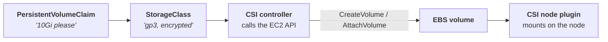

# 💾 Dev Platform: Persistent Storage Without EKS

_Milestone 4, part 1: the EBS CSI driver on a self-hosted cluster, and every piece of work EKS normally does for you without saying so_

## 🎯 What I was trying to do

On EKS, installing the EBS CSI driver feels like installing a Helm chart. On a self-hosted cluster, that chart is the easy part.

[Part 4](/blog/argocd-app-of-apps-bootstrap) ended with a cluster that reconciles itself from Git and can't do anything useful yet. No storage, no ingress, no TLS, no DNS. M4 is where that changes, and storage goes first, because almost everything coming later needs it: Prometheus metrics, Loki logs, OneDev repositories, Backstage's Postgres.

A pod's filesystem is thrown away every time the pod restarts or moves to another node. Anything stateful loses its data without a disk that outlives the pod. On AWS that disk is an EBS volume, and the thing that creates, attaches and deletes EBS volumes on Kubernetes' behalf is the **EBS CSI driver**.

The driver's installation guide is written for EKS, and that turned out to be the whole story of this step: **every AWS-flavoured default quietly assumes EKS is doing something for you in the background.** Take EKS away and those somethings become your job, one crash at a time.

---

## 🧩 How a PVC becomes an EBS disk

The chain has four links:



A **StorageClass** is a recipe. A **PersistentVolumeClaim** is a request. The driver reads the request, follows the recipe, and calls AWS.

The driver itself comes in two halves, and the split matters for everything that follows:

- **The controller** (a Deployment) talks to the EC2 API — create, attach, detach, delete. It needs **AWS permissions**.
- **The node plugin** (a DaemonSet, one per node) formats and mounts the disk once it's attached. It needs to know **which EC2 instance it's running on**.

Two different needs, two different ways for a non-EKS cluster to fail. I hit both.

---

## 📦 One chart, one values file

Every M4 component follows the same pattern the Argo CD chart established in M3: a thin umbrella chart that declares the upstream chart as a [dependency](https://helm.sh/docs/topics/charts/#chart-dependencies).

```yaml
# argocd/platform/ebs-csi/Chart.yaml
dependencies:
  - name: aws-ebs-csi-driver
    version: 2.66.0 # driver v1.66.0
    repository: https://kubernetes-sigs.github.io/aws-ebs-csi-driver
```

The name, version and repository come from the chart's [ArtifactHub page](https://artifacthub.io/packages/helm/aws-ebs-csi-driver/aws-ebs-csi-driver). The values file is where the work is, and no document tells you what goes in it — the documentation **is** the upstream chart's own [`values.yaml`](https://github.com/kubernetes-sigs/aws-ebs-csi-driver/blob/master/charts/aws-ebs-csi-driver/values.yaml):

```bash
helm show values aws-ebs-csi-driver \
  --repo https://kubernetes-sigs.github.io/aws-ebs-csi-driver --version 2.66.0
```

My file holds only the keys I change, nested under the dependency name. Put a key at the top level instead and Helm doesn't complain — it just never reaches the chart. Then the loop, for every change:

```bash
cd argocd/platform/<name>
helm dependency update     # downloads the upstream chart
helm template test . | less  # read what it will actually create
helm lint .
```

`helm template` with empty values was the most useful command of the milestone. It rendered 24 resources, and reading them told me what I still had to write.

### 🗄️ The StorageClass

With default values the chart creates **no StorageClass at all**, so a PVC would have nothing to bind to. It offers two ways to get one: a `defaultStorageClass.enabled` switch that creates a fixed class nobody can configure, or a `storageClasses` list you fill in yourself. I took the list:

```yaml
aws-ebs-csi-driver:
  storageClasses:
    - name: ebs-sc
      annotations:
        storageclass.kubernetes.io/is-default-class: "true"
      volumeBindingMode: WaitForFirstConsumer
      allowVolumeExpansion: true
      reclaimPolicy: Delete
      parameters:
        type: gp3
        encrypted: "true"   # no kmsKeyId → the AWS-managed aws/ebs key
```

**[`WaitForFirstConsumer`](https://kubernetes.io/docs/concepts/storage/storage-classes/#volume-binding-mode)** exists because an EBS volume lives in exactly one availability zone and can only attach to an instance in that same zone. The alternative, `Immediate`, creates the disk the moment the PVC exists — before any pod does — so the driver has to guess a zone:

```text
Immediate:
  PVC created    →  disk created in eu-central-1b
  pod created    →  scheduled onto a node in eu-central-1a
  pod mounts     →  ✗ stuck Pending: the disk is in the wrong zone

WaitForFirstConsumer:
  PVC created    →  nothing yet (PVC Pending — this is normal)
  pod created    →  scheduled onto a node in eu-central-1a
  driver         →  creates the disk in eu-central-1a
  pod mounts     →  ✓
```

All three of my nodes are in one subnet, so today both modes would work. The setting is there for the day they aren't.

**`allowVolumeExpansion`** is the interesting one, because it isn't in the chart's example comment. I didn't find it in the chart at all — it's a field of Kubernetes' own [StorageClass object](https://kubernetes.io/docs/concepts/storage/storage-classes/#storageclass-objects). What the chart's [template](https://github.com/kubernetes-sigs/aws-ebs-csi-driver/blob/master/charts/aws-ebs-csi-driver/templates/storageclass.yaml) decides is whether I can *reach* it:

```yaml
provisioner: ebs.csi.aws.com
{{ omit (dict "volumeBindingMode" "WaitForFirstConsumer" | merge .) "name" "annotations" "labels" | toYaml }}
```

Read it inside out: start from a default `volumeBindingMode`, merge my entry over it, strip the three keys that already went into `metadata`, and dump **whatever is left** as top-level fields. It's a blind passthrough. Any StorageClass field works — and so does any typo, which Helm will render without complaint. The same line has one trap: `provisioner` is hardcoded above it, so setting it in values produces the key twice.

Without expansion enabled, growing a full Prometheus disk later gets rejected outright:

```text
only dynamically provisioned pvc can be resized and the storageclass that provisions the pvc must support resize
```

**`encrypted` without a `kmsKeyId`** uses the AWS-managed `aws/ebs` key, which needs no extra permissions. A customer-managed key would mean adding KMS permissions to the driver's IAM role — noted in the file, deliberately not done.

One more line went in: `helmTester.enabled: false`. The chart ships five resources for `helm test`, and Argo CD [ignores Helm test hooks](https://argo-cd.readthedocs.io/en/stable/user-guide/helm/#helm-hooks), so they'd only clutter every render.

---

## 📜 The docs had the wrong ARN

The driver's [install guide](https://github.com/kubernetes-sigs/aws-ebs-csi-driver/blob/master/docs/install.md) says AWS publishes a managed policy for it, `AmazonEBSCSIDriverPolicyV2`, available at:

```text
arn:aws:iam::aws:policy/service-role/AmazonEBSCSIDriverPolicyV2
```

I swapped the V1 policy for it in `terraform/07-irsa.tf`, then checked the ARN before applying anything:

```text
An error occurred (NoSuchEntity) when calling the GetPolicy operation:
Policy arn:aws:iam::aws:policy/service-role/AmazonEBSCSIDriverPolicyV2 was not found.
```

V1 lives under `service-role/`. V2 doesn't. The [AWS managed-policy reference page](https://docs.aws.amazon.com/aws-managed-policy/latest/reference/AmazonEBSCSIDriverPolicyV2.html) has it right:

```json
{
  "PolicyName": "AmazonEBSCSIDriverPolicyV2",
  "Arn": "arn:aws:iam::aws:policy/AmazonEBSCSIDriverPolicyV2",
  "Path": "/",
  "CreateDate": "2026-04-16T17:27:15+00:00"
}
```

My guess is someone took the V1 ARN, added `V2` to the end, and nobody ran it. When the documentation and the API disagree, the API wins.

The V2 policy also changes the rules in a way worth writing down now. Its description says it limits the driver to volumes and snapshots **tagged `ebs.csi.aws.com/cluster: true`**. The install guide says the driver applies that tag to dynamically provisioned resources ([announcement](https://github.com/kubernetes-sigs/aws-ebs-csi-driver/issues/2918)), and the test volume at the end of this post carried it, so normal PVCs are fine. But a volume restored from a Velero snapshot in M7, or imported by hand, won't carry the tag unless something puts it there — and the driver will be denied.

---

## 🪪 The annotation that does nothing

The install guide's [IRSA section](https://github.com/kubernetes-sigs/aws-ebs-csi-driver/blob/master/docs/install.md#iam-roles-for-serviceaccounts-ie-irsa), like every IRSA guide, says to annotate the controller's ServiceAccount with the role:

```yaml
controller:
  serviceAccount:
    annotations:
      eks.amazonaws.com/role-arn: arn:aws:iam::<account-id>:role/dev-platform-ebs-csi
```

It's easy to read that as "this is how IRSA works". It isn't. **The annotation is an instruction to a component that doesn't exist on my cluster — and everything else in this section is me doing that component's job.**

On EKS, the [Pod Identity Webhook](https://github.com/aws/amazon-eks-pod-identity-webhook) watches for pods whose ServiceAccount carries that annotation and rewrites them before they start. [Its README](https://github.com/aws/amazon-eks-pod-identity-webhook/blob/master/README.md?plain=1#L93-L115) shows exactly what it adds:

```yaml
### Everything below is added by the webhook ###
    env:
    - name: AWS_ROLE_ARN
      value: "arn:aws:iam::111122223333:role/s3-reader"
    - name: AWS_WEB_IDENTITY_TOKEN_FILE
      value: "/var/run/secrets/eks.amazonaws.com/serviceaccount/token"
    volumeMounts:
    - mountPath: "/var/run/secrets/eks.amazonaws.com/serviceaccount/"
      name: aws-token
  volumes:
  - name: aws-token
    projected:
      sources:
      - serviceAccountToken:
          audience: "sts.amazonaws.com"
          expirationSeconds: 86400
          path: token
```

No webhook, no rewrite. Two pieces matter.

**The projected volume** asks the kubelet for a second ServiceAccount token. Every pod already gets one, but its audience is the Kubernetes API server, and the trust policy I wrote in M2 insists on something else:

```hcl
condition {
  test     = "StringEquals"
  variable = "${local.oidc_provider_identifier}:aud"
  values   = ["sts.amazonaws.com"]
}
```

A [`serviceAccountToken` projection](https://kubernetes.io/docs/concepts/storage/projected-volumes/#serviceaccounttoken) lets me choose the audience. The kubelet mints a JWT signed by the API server's key — the same key whose public half M2 published to S3 — writes it to a file, and [rotates it](https://kubernetes.io/docs/tasks/configure-pod-container/configure-service-account/#serviceaccount-token-volume-projection) once it's older than 80% of its lifetime. The claims line up one for one with the trust policy:

```text
iss: https://dev-platform-oidc-<account-id>.s3.eu-central-1.amazonaws.com   ← the OIDC provider from M2
sub: system:serviceaccount:kube-system:ebs-csi-controller-sa                ← the :sub condition
aud: sts.amazonaws.com                                                      ← the :aud condition
```

**The env vars** tell the AWS SDK inside the driver to use it. With [`AWS_ROLE_ARN` and `AWS_WEB_IDENTITY_TOKEN_FILE`](https://docs.aws.amazon.com/sdkref/latest/guide/feature-assume-role-credentials.html) set, the SDK reads the file, calls `sts:AssumeRoleWithWebIdentity`, and refreshes the credentials on its own. The driver code never knows.

My version:

```yaml
controller:
  serviceAccount:
    annotations:
      # documentation only — off EKS nothing reads this
      eks.amazonaws.com/role-arn: &ebsRoleArn arn:aws:iam::<account-id>:role/dev-platform-ebs-csi
  region: eu-central-1
  env:
    - name: AWS_ROLE_ARN
      value: *ebsRoleArn
    - name: AWS_WEB_IDENTITY_TOKEN_FILE
      value: "/var/run/secrets/eks.amazonaws.com/serviceaccount/token"
  volumeMounts:
    - mountPath: "/var/run/secrets/eks.amazonaws.com/serviceaccount/"
      name: aws-token
  volumes:
    - name: aws-token
      projected:
        sources:
          - serviceAccountToken:
              audience: "sts.amazonaws.com"
              expirationSeconds: 86400
              path: token
```

Two details in there earn their line.

**The YAML anchor.** `&ebsRoleArn` defines the ARN once and `*ebsRoleArn` reuses it. Without it, the annotation and the env var are two copies of the same string, and the day they disagree the annotation says one role while the driver quietly uses another.

**No `subPath`.** M3's Argo CD values mount the `sops` binary with `subPath`, and copying that pattern here would be a slow disaster. The [Kubernetes docs](https://kubernetes.io/docs/concepts/storage/projected-volumes/#serviceaccounttoken) are explicit that a projected volume mounted with `subPath` **never receives updates**. The token would work on day one and the driver would lose AWS access about 24 hours after the pod started.

(`region` becomes `AWS_REGION`, so the controller never has to ask instance metadata where it is — hold that thought.)

The render also showed me something I hadn't written. The chart injects `AWS_ACCESS_KEY_ID` and `AWS_SECRET_ACCESS_KEY` into the same container, read from a Secret called `aws-secret` with `optional: true`. That Secret doesn't exist, so the variables stay empty. But in the SDK's credential chain **static keys come before web identity**. If an `aws-secret` ever turned up in `kube-system`, it would silently take over from IRSA — and nothing about the pod would look different.

---

## 💥 CrashLoopBackOff: two metadata sources, both empty

I rebuilt the cluster, pushed, and Argo CD synced the app. The controllers came up `5/5 Running`. The three node pods went into `CrashLoopBackOff`.

The node pod has three containers, and two of them were only complaining about the third:

```text
node-driver-registrar  "Still connecting" address="unix:///csi/csi.sock"
liveness-probe         "Still connecting" address="unix:///csi/csi.sock"
```

The real error was in `ebs-plugin`:

```text
"Attempting to retrieve instance metadata from IMDS"
"Retrieving IMDS metadata failed" err="could not get IMDS metadata: operation error ec2imds: GetInstanceIdentityDocument, canceled, context deadline exceeded"
"Attempting to retrieve instance metadata from Kubernetes API"
"Retrieving Kubernetes metadata failed" err="node providerID empty, cannot parse"
"Failed to initialize metadata when it is required" err="all specified --metadata-sources '[imds kubernetes]' are unavailable"
```

This is the node plugin asking "which EC2 instance am I on?" and trying its two sources in turn. **IMDS timed out. The Kubernetes fallback found no `providerID` on the node.** Both empty, so it exits.

The second one I expected: `providerID` is set by the AWS cloud-controller-manager, which I don't run. The first one was the puzzle. The instances had IMDSv2 required and a hop limit of 2 — which is exactly what the [driver's docs](https://github.com/kubernetes-sigs/aws-ebs-csi-driver/blob/master/docs/install.md#imds-ec2-metadata) say you need:

> In order for the driver to access IMDS, it either must be run in host networking mode, or with a hop limit of at least 2.

So I tested it from inside the cluster, from an ordinary pod:

```text
IMDSv1 GET  /latest/meta-data/instance-id  →  HTTP 401
IMDSv2 PUT  /latest/api/token              →  curl timeout
```

That pair is the whole diagnosis. The 401 showes the network path to IMDS is fine — it's AWS answering "use v2". The PUT timing out means the one response that's special isn't coming back. IMDSv2 sends its token response with a deliberately tiny TTL — the [hop limit](https://docs.aws.amazon.com/AWSEC2/latest/UserGuide/configuring-instance-metadata-options.html) — so it can't travel past the instance. Every routing hop decrements it; at zero the packet is dropped, silently, and the client waits until its deadline.

So the documented minimum wasn't enough here. The next sentence in the driver's docs says why that can happen, and I'd skimmed past it:

> CNI plugins other than the Amazon VPC CNI plugin may add additional routing layers and necessitate a higher hop limit.

My cluster runs Cilium in tunnel mode, which routes the response through its own datapath on the way back into the pod. My working theory was that those were the extra hops. The test was cheap: I raised one node to 3 with the CLI and deleted its pod:

```bash
aws ec2 modify-instance-metadata-options --region eu-central-1 \
  --instance-id i-07cf59c60fd94bfde --http-put-response-hop-limit 3 --http-tokens required
```

```text
"Attempting to retrieve instance metadata from IMDS"
"Retrieved metadata from IMDS"
```

That node went `3/3 Running`; the other two kept crashing. Cause proven, one variable changed. Then into Terraform, where it belongs, as [`metadata_options`](https://registry.terraform.io/providers/hashicorp/aws/latest/docs/resources/instance#metadata-options):

```hcl
# Cilium's tunnel routing adds hops, so pods need more than the default of 2.
# No instance profile on these nodes, so IMDS exposes no credentials.
# https://github.com/kubernetes-sigs/aws-ebs-csi-driver/blob/master/docs/install.md#imds-ec2-metadata
metadata_options {
  http_endpoint               = "enabled"
  http_tokens                 = "required" # IMDSv2 only
  http_put_response_hop_limit = 3
}
```

Two decisions hide in that block.

**Why pin `http_tokens`, when it's already `required`?** Because the current value doesn't come from my code. The Talos AMI is registered with `ImdsSupport: v2.0`, and that's what makes AWS launch the instances with IMDSv2 required and a hop limit of 2. My Terraform picks the AMI by version filter. A future image without that flag would quietly re-enable IMDSv1, and no line in the repo would show it happening.

**Why not `hostNetwork` instead?** The chart has `node.hostNetwork`, and with it the node plugin would skip Cilium entirely and work at the default hop limit. It's the narrower fix: only one pod gets the metadata service. A hop limit of 3 opens IMDSv2 to **every** pod on the node. That's normally the argument against it — IMDS is where instance credentials live. But these instances have no instance profile. There are no credentials in IMDS to steal, only the instance's own facts. I took the broader, simpler fix and wrote that condition next to it, because if an instance profile ever appears, the tradeoff flips.

One caution on applying it: the plan also wanted to re-apply the Talos config on every node, even though nothing about Talos had changed, because the Talos data sources depend on the instances and couldn't be read at plan time. I applied the instances alone with `-target` first, and the full plan that followed showed no Talos changes — proof the rest had been noise.

---

## 🔁 Healthy, but never Synced

With the node pods running, Argo CD reported the app `Healthy` — and `OutOfSync`, and it stayed that way after every sync.

Only one resource differed, the `CSIDriver` object, and only one field:

```yaml
nodeAllocatableUpdatePeriodSeconds: 10   # in Git, absent from the cluster
```

The chart's [template](https://github.com/kubernetes-sigs/aws-ebs-csi-driver/blob/master/charts/aws-ebs-csi-driver/templates/csidriver.yaml) writes that field whenever the cluster is Kubernetes 1.33 or newer. The comment above the value in [`values.yaml`](https://github.com/kubernetes-sigs/aws-ebs-csi-driver/blob/master/charts/aws-ebs-csi-driver/values.yaml) explains the catch:

> This parameter is supported in Kubernetes 1.33+ and requires the MutableCSINodeAllocatableCount feature gate to be enabled in kubelet and kube-apiserver.

The API server will tell you whether that [feature gate](https://kubernetes.io/docs/reference/command-line-tools-reference/feature-gates/) is on:

```text
v1.34.1
kubernetes_feature_enabled{name="MutableCSINodeAllocatableCount",stage="BETA"} 0
```

Beta, and off. So the chart writes the field, the API server drops a field it doesn't recognise, and Argo CD compares Git (present) with the cluster (absent) forever. With plain `helm install` nobody would ever notice. **Under GitOps, a field the API server silently drops becomes a permanent diff.**

Helm can't do better on its own: a template can see the Kubernetes version, not which feature gates are on, so "the feature exists" and "the feature is enabled" look the same to it. The template's own logic gives the way out — `-1` means "decide for me", and `0` writes nothing:

```yaml
aws-ebs-csi-driver:
  # Needs the MutableCSINodeAllocatableCount feature gate, which is beta and
  # off in 1.34 — the apiserver drops the field and Argo CD never syncs.
  nodeAllocatableUpdatePeriodSeconds: 0
```

The live `CSIDriver` still has fields my render doesn't — `seLinuxMount: false`, `storageCapacity: false` — which the API server fills in as defaults. Those don't cause a diff, because the app syncs with [`ServerSideApply=true`](https://argo-cd.readthedocs.io/en/stable/user-guide/sync-options/#server-side-apply) and Argo CD compares only the fields it actually manages. I'd copied that sync option from M3 without a reason of my own; now I have one.

---

## 🧪 Proving it

Everything so far proved the driver starts. Nothing had asked it for a volume yet, so the IRSA setup from M2 was still untested. The check is `scripts/verify-m4-ebs.sh`: a PVC with no StorageClass named, a pod that writes to it, assertions against Kubernetes and AWS, then teardown.

The run:

```text
2. IMDS reachable from pods (instance metadata options)
  PASS  dev-platform-worker-1: IMDSv2 required, hop limit 3
  PASS  dev-platform-master: IMDSv2 required, hop limit 3
  PASS  dev-platform-worker-0: IMDSv2 required, hop limit 3

3. Driver deployed and healthy
  PASS  ebs-csi Application: Synced/Healthy
  PASS  ebs-csi-controller available
  PASS  ebs-csi-node DaemonSet 3/3 ready

4. Default StorageClass
  PASS  ebs-sc is the only default StorageClass

5. End-to-end volume lifecycle
  PASS  PVC Pending before any pod exists (WaitForFirstConsumer)
  PASS  pod Ready with the volume mounted
  PASS  PVC Bound via ebs-sc
  PASS  pod wrote and read back a file on the volume
  PASS  vol-0b56a303c274c3ed9: gp3
  PASS  vol-0b56a303c274c3ed9: encrypted
  PASS  vol-0b56a303c274c3ed9: attached (in-use)
  PASS  vol-0b56a303c274c3ed9: tagged ebs.csi.aws.com/cluster=true
  PASS  vol-0b56a303c274c3ed9 deleted from AWS after PVC deletion

6. IRSA errors in the controller
  PASS  no credential errors in ebs-plugin logs during the test

M4 EBS CSI verification passed.
```

The `CreateVolume` behind that `gp3` line is the first time anything in this cluster has used the M2 chain for real: a kubelet-minted token, checked by STS against public keys on my own S3 bucket, exchanged for credentials on a role scoped to one ServiceAccount. Three milestones of setup, proven by one encrypted 1 GiB disk that existed for about a minute.

---

## 📝 What I'll remember

**The values file is the documentation.** There's no guide that tells you what to put in `values.yaml`. `helm show values` lists every option, the templates show what they actually do, and the Kubernetes API reference lists what the underlying object accepts. The example comments are a sample, not the menu.

**Annotations are requests, not mechanisms.** `eks.amazonaws.com/role-arn` does nothing by itself; it's a note to a webhook. When a "works on EKS" instruction does nothing on your cluster, find the EKS component that would have read it, look at what it does, and do that part yourself.

**"At least 2" is a minimum, not an answer.** The docs themselves say other CNIs may need more. On my Cilium cluster it took 3. A 401 on the GET next to a timeout on the PUT said so in two lines — cheaper than any amount of reasoning about it.

**Pin the security setting you're relying on.** IMDSv2 was required because of a flag on someone else's AMI. Now it's required because a line in my repo says so.

**Documentation is a claim; the API is the answer.** The install guide's V2 ARN doesn't exist. Checking one ARN before an apply is cheaper than finding out halfway through a rebuild.

**Under GitOps, silent drops become loud diffs.** A field the API server discards is invisible to `helm install` and permanent to Argo CD. "Healthy but OutOfSync forever" usually means the cluster is rewriting something you declared.

---

## 💭 Where this leaves me

The cluster has storage. `ebs-sc` is the default StorageClass, volumes come up gp3 and encrypted in the right zone, grow on request and disappear when their claim does. The M2 IRSA setup has now carried a real AWS call. And the node plugin has told me something about the nodes that I'd have otherwise found out in the next step: **they have no `providerID`.**

That matters for what's next. The AWS Load Balancer Controller registers nodes as NLB targets by instance ID, and since Cilium hands out pod IPs from its own range rather than the VPC's, I expect `ip` target mode to be off the table — so it likely needs `instance` mode, which needs that `providerID`. The driver's [docs](https://github.com/kubernetes-sigs/aws-ebs-csi-driver/blob/master/docs/install.md#kubernetes-metadata) name the component that sets it, plus the zone and instance-type labels next to it: the AWS cloud-controller-manager. That's the next thing to read about.

After that come the parts of M4 that need decisions rather than values. ingress-nginx has been retired since this plan was written, so the ingress controller is an open question — Cilium already ships an Ingress and Gateway API implementation. And the first SOPS-encrypted secret, the Cloudflare token, needs Argo CD to actually call `sops` during rendering, which a plain Helm source never does.

Storage was supposed to be the easy part. It was — once I'd done the things EKS usually does without telling anyone.
