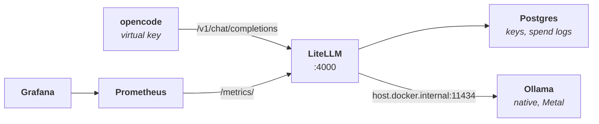

# 🤖 LLM Platform: The Whole Stack on a MacBook

_Milestone 0: an OpenAI-compatible gateway with keys, spend tracking and metrics in front of a local Qwen model, and why the first reply took four minutes_

## 🎯 What I was trying to do

Some people buy an API subscription. I build a platform, write Terraform for it, and blog about the outage. This is the LLM edition: a private LLM platform I run myself, in the same spirit as the [dev platform](/blog/talos-kubernetes-on-aws-terraform). The product isn't a chat UI. It's an **OpenAI-compatible API** with the things a platform team would actually care about: per-user keys, budgets, rate limits, spend attribution and metrics. Open-weight Qwen models sit behind it, and terminal clients sit in front of it. The main client is [opencode](https://opencode.ai), an open-source coding agent. That makes it a demanding client: long system prompts, big contexts, multi-turn tool calls.

The end state has a small control plane on EC2, reachable only over Tailscale, and a spot GPU running vLLM that exists only while I'm testing. Before spending a cent on that, **M0 is the whole thing on my MacBook, for $0**:

- **[LiteLLM](https://github.com/BerriAI/litellm)** as the gateway: keys, users, budgets, spend logs, model aliases
- **Postgres** for LiteLLM's state
- **Prometheus + Grafana** for metrics
- **Ollama**, running natively, serving Qwen3 8B

If the wiring works here, the AWS milestones only change where things run, not what they are.

_Versions used in this post: LiteLLM v1.103.2, Ollama 0.35.0, opencode 1.18.30, Prometheus 3.14.0, Postgres 18, Qwen3 8B (Q4_K_M), on a MacBook with an M4 (8-core GPU) and 16 GB of RAM. Several details below are version-specific._

---

## 🧩 The shape



Everything except Ollama runs in Docker Compose. Ollama runs outside Docker on purpose: at the time of writing (October 2026), **Docker Desktop on macOS can't give containers the GPU (Metal)**, so a model inside a container would run on the CPU. Docker's own Model Runner runs on the host on Macs for exactly this reason: [there is no GPU passthrough for Metal in containers](https://www.docker.com/blog/docker-model-runner-vllm-metal-macos/). Compose's [GPU support](https://docs.docker.com/compose/how-tos/gpu-support/) is for NVIDIA GPUs on Linux, which is what the GPU backend will use in M3. LiteLLM reaches Ollama through `host.docker.internal`.

Clients never see a model name like `qwen3:8b`. They see an alias, `qwen-small`, and later `qwen-large`. Which backend serves an alias is the gateway's business, and it will change: Ollama on the Mac today, the Mac over the tailnet in M2, vLLM on an L4 in M3.

---

## 🧠 The model and its context window

```dockerfile
FROM qwen3:8b
PARAMETER num_ctx 32768
```

That's the entire Modelfile, and the second line is the important one. Ollama's [default context window](https://docs.ollama.com/faq#how-can-i-specify-the-context-window-size) is 4,096 tokens, and when a prompt doesn't fit, Ollama **truncates it**, with nothing more than a line in its server log. An agent's prompt is mostly system prompt and tool definitions, so truncation quietly removes the part that tells the model how to call tools. opencode's [provider docs](https://opencode.ai/docs/providers#ollama) say it directly: 

> "If tool calls aren't working, try increasing `num_ctx` in Ollama. Start around 16k - 32k."

```sh
ollama create qwen3-8b-32k -f stack/ollama/Modelfile
```

---

## 📦 The compose stack

The rest of the stack is one `compose.yaml`. I started from LiteLLM's own [docker-compose.yml](https://github.com/BerriAI/litellm/blob/main/docker-compose.yml), which already wires LiteLLM to Postgres and Prometheus, and built on it:

- **`litellm`** with its config mounted, and `DATABASE_URL` and the master key coming from `.env`
- **`postgres`** with a healthcheck, so LiteLLM waits until the database accepts connections before running its migrations
- **`prometheus`** and **`grafana`**

Every port is bound to `127.0.0.1`, and the secrets live in a gitignored `.env`. In M2, cloud-init will write that same file from SSM Parameter Store, so the compose file won't change when the stack moves to EC2.

---

## 🔑 Keys: one admin, many users

LiteLLM has two kinds of keys, and keeping them apart is a requirement in its own right:

- The **master key** is the admin credential. It creates keys, users and teams, and nothing else should use it.
- **Virtual keys** are what clients use. Each one belongs to a user, is limited to certain model aliases, and every request it makes is written to the spend logs.

```sh
curl -s localhost:4000/key/generate -H "Authorization: Bearer $LITELLM_MASTER_KEY" \
  -H 'Content-Type: application/json' \
  -d '{"models":["qwen-small"],"user_id":"denes","key_alias":"denes-opencode"}' | jq -r .key
```

---

## 💻 opencode, and the model that wasn't there

opencode talks to any OpenAI-compatible endpoint through a [custom provider](https://opencode.ai/docs/providers/). The [`{env:…}` substitution](https://opencode.ai/docs/config/#env-vars) keeps the key out of the file:

```json
{
  "$schema": "https://opencode.ai/config.json",
  "provider": {
    "litellm": {
      "npm": "@ai-sdk/openai-compatible",
      "name": "LiteLLM (llm-platform)",
      "options": {
        "baseURL": "http://localhost:4000/v1",
        "apiKey": "{env:LITELLM_API_KEY}"
      },
      "models": {
        "qwen-small": {
          "name": "Qwen3 8B (Ollama)",
          "limit": { "context": 32768, "output": 8192 }
        }
      }
    }
  },
  "model": "litellm/qwen-small"
}
```

Then opencode started, and the model wasn't in the list. The config was fine: `opencode models` with [`OPENCODE_CONFIG`](https://opencode.ai/docs/config/#custom-path) set listed it right away. The shell I'd launched the interface from just didn't have the variable, so opencode fell back to my empty global config. No error, no warning, one model missing. Exporting an absolute path in the right shell fixed it, and after that opencode called its tools through the gateway and the requests showed up in the spend logs under my user.

It was also **really slow**.

---

## 🐢 "It works. It's really slow."

I measured instead of guessing, and found three separate problems stacked on top of each other. Each one needed its own measurement and its own fix, and one of them had no fix.

**1. The Mac was swapping.** Ollama held 9.9 GB: about 5 GB of weights and about 4.7 GB of KV cache for a 32k context at full precision. On a 16 GB Mac, macOS lets the GPU use only about 10–11 GB. With Docker Desktop running, and a forgotten `kind` cluster from another project using 1.8 GB inside it 😵‍💫, free memory was at 11% and **swap reached 10.9 GB**.

The fix was stopping `kind` and shrinking the KV cache, with flash attention and an 8-bit cache:

```sh
OLLAMA_FLASH_ATTENTION=1 OLLAMA_KV_CACHE_TYPE=q8_0 OLLAMA_KEEP_ALIVE=30m ollama serve
```

Ollama went from 9.9 GB to **8.0 GB**, free memory from 11% to 27%, and swap started to drain.

**2. qwen3 thinks before it answers.** By default, every reply starts with a "thinking" block. The [Qwen3 model card](https://huggingface.co/Qwen/Qwen3-8B) says so ("By default, Qwen3 has thinking capabilities enabled"), and so does Ollama:

```sh
ollama show qwen3:8b
```

```
  Capabilities
    completion
    tools
    thinking
        levels     false, true
        default    true
```

For "what is 17 × 23?", the model generated **about 740 tokens**, almost all of them thinking, for an answer that fits in one line. At about 10 tokens/s, that's over a minute of reasoning about an arithmetic question, on every turn of every agent loop.

The fix is the switch from Ollama's [thinking docs](https://docs.ollama.com/capabilities/thinking), set once in the gateway so no client has to know about it:

```yaml
# stack/litellm/config.yaml
litellm_params:
  model: ollama_chat/qwen3-8b-32k
  think: false
```

The 17 × 23 question went from a minute-plus to **2.2 seconds**, and tool calls still came back as proper `tool_calls`.

**3. opencode's prompt is large.** It sends its system prompt and tool definitions with every request, about 10k tokens. During the swapping, that took **282 seconds** before the first token came back. With swapping gone, it still took **220**. This MacBook has the **M4 with an 8-core GPU**, which processes prompts at about 80–110 tokens/s, so on this Mac a 10k-token prompt is still two to four minutes of work. Configuration took away the memory pressure, but it couldn't make the prompt processing itself faster. This one has no fix on this hardware.

| | Before | After |
|---|---|---|
| Ollama memory | 9.9 GB | **8.0 GB** |
| Free memory | 11% | 27% |
| Short question | ~70 s | **2.2 s** |
| First turn, ~12k-token prompt | 282 s | 220 s |
| Follow-up turn, same prompt | 75 s | **1.3 s** |

**The most misleading number here is the first request.** After the fixes, the same ~12k-token conversation took 220 seconds on its first turn and 1.3 seconds on the next one. Ollama keeps the processed prompt in a cache, and opencode's prompt barely changes between turns, so only the first turn pays for it. One request is not a benchmark for an agent: first-turn latency and later-turn latency are different numbers, and they need to be measured separately. The cache holds one prompt, though, so that only works while nothing else uses Ollama in between. That will matter in M4, when several simulated users share one backend.

The `ollama_chat/` prefix in that config matters too. LiteLLM's [Ollama docs](https://docs.litellm.ai/docs/providers/ollama) recommend it over `ollama/`, and the reason is in Ollama's API. `ollama/` uses [`/api/generate`](https://docs.ollama.com/api/generate), which takes a single prompt string and has no `tools` parameter, so LiteLLM has to flatten the conversation into text and fake tool calls with JSON mode. `ollama_chat/` uses [`/api/chat`](https://docs.ollama.com/api/chat), which takes the messages with their roles plus a native `tools` list, and Ollama formats them with the model's own chat template. For an agent that lives on tool calls, that's the difference between the model's trained format and an imitation of it.

---

## 📊 The metrics that weren't being scraped

One of my open questions before the AWS milestones was whether the **open-source** LiteLLM exposes Prometheus metrics at all, or whether that's behind the enterprise license. If it was licensed, the plan was to point Grafana at the spend logs in Postgres instead.

It turned out to be open source: TTFT histograms, per-deployment latency, token counters, in-flight requests, remaining key budget. All of it was there. But Prometheus had been storing none of it:

```
litellm  down  server returned HTTP status 401 Unauthorized
```

In this version the endpoint requires a key by default. I also found that `/metrics` answers with a 307 redirect to `/metrics/`. Prometheus follows redirects, so that part was harmless, but it's an extra hop I'd rather not have.

```yaml
# litellm/config.yaml
litellm_settings:
  callbacks: ["prometheus"]
  require_auth_for_metrics_endpoint: false
```

```yaml
# prometheus.yml
- job_name: "litellm"
  metrics_path: /metrics/
```

Turning auth off is acceptable here because port 4000 is bound to localhost now and will be tailnet-only in M2. The alternative was giving Prometheus a key, and the only key that works without extra setup is the master key, which is exactly the credential I want in as few places as possible.

The lesson is about the failure mode, not the fix. **A scrape target that's down doesn't break anything you'd notice.** Prometheus was healthy, Grafana was healthy, LiteLLM was healthy. The data just never arrived. The only way to catch that is to check the targets page, so that check is now in the verify script.

---

## ✅ verify-m0.sh

M0 isn't done because the containers are green. Everything was green while the model was missing, the metrics were empty and the first reply took four minutes. It's done because a script can prove the contract: keys, aliases, streaming, tool calls, spend attribution, metrics and a real agent task. M0's script creates a temporary virtual key, runs its checks with it, and deletes the key on exit:

```
Stack
  PASS postgres is running healthy
  PASS litellm is running healthy
  PASS prometheus is running
  PASS grafana is running
  PASS R12 Ollama serves qwen3-8b-32k

Auth
  PASS R3 request without a key is rejected (401)
  PASS R3 request with an invalid key is rejected (401)
  PASS R5 master key does not appear in client configs

API
  PASS R6/R8 /v1/models lists qwen-small
  PASS R6 chat completion streams (15 chunks)
  PASS R7 tool call returns tool_calls ("{\"path\": \"/tmp\"}")

Tracking
  PASS requests show up in spend logs for user verify-m0 (2)
  PASS Prometheus scrapes LiteLLM

Clients
  PASS R20 opencode completes a task (found stack/litellm/config.yaml)
  SKIP R21 quick-chat client (neither llm nor aichat is installed)

14 passed, 0 failed, 1 skipped
```

The opencode check runs a real agent task, `opencode run`, asking it to list a directory with its own tools, and it accounts for most of the 1 minute 40 seconds the script takes. It's the slowest check, and the only one that proves the whole chain end to end.

---

## 📝 What I'll remember

**Measure before tuning.** "It's slow" turned out to be three separate problems: memory pressure, a thinking model, and a large prompt on a small GPU. Each had a different fix, and one of them, the hardware, had none. Without the numbers, I'd have tuned the wrong thing.

**Defaults are made for someone else's use case.** qwen3 thinks by default, which helps on hard questions and is expensive on the many agent turns that don't need it. Ollama's default context window is small, which saves memory and truncates agent prompts. LiteLLM's metrics need a key by default, which is the safe choice for a public gateway and an obstacle for a private one. None of them were wrong, they just weren't made for an agent on a private gateway.

**Silent failures need explicit checks.** A missing environment variable meant a missing model, a down scrape target meant empty dashboards, and a truncated context means quietly broken tool calls. None of them raised an error. The verify script exists for exactly this.

---

## 💭 Where this leaves me

The platform runs on the Mac: opencode → LiteLLM → Ollama, with per-user keys, spend logs and Prometheus metrics, all verified by one script. It's slow on a first turn, and that's fine. The Mac backend exists to prove the wiring, and speed is the GPU's job.

Two open questions closed along the way. The open-source LiteLLM does export Prometheus metrics, so Grafana doesn't need the Postgres workaround. And the LiteLLM image is multi-arch (`linux/amd64` and `linux/arm64`), so the control plane can run on a **t4g.medium**, a Graviton instance and the cheaper option.

Next is M1: the AWS foundation in Terraform, with a VPC, IAM, SSM parameters for the secrets that currently live in `.env`, and a budget alert set up before anything costs money. In parallel, the G-instance spot vCPU quota request goes in now, because approval can take days and M3 can't start without it.

The Mac was never meant to be the backend. It's the test bench where the platform's contract (keys, aliases, tool calls, spend logs, metrics) gets proven for free, before the cloud adds its own ways to fail. That contract now holds, and `verify-m0.sh` will keep checking it.
